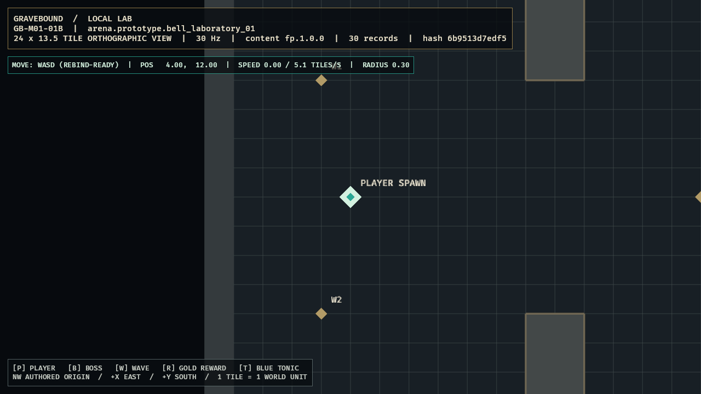

# Gravebound

Gravebound is a server-authoritative, permanent-death, 2D dark-fantasy bullet-hell dungeon crawler inspired by the immediacy and social danger of *Realm of the Mad God*.

Every character life is temporary. The account remembers what happened, and exceptional deaths can return as personalized Fallen Hero Echo encounters. The design emphasizes readable combat, rapid recovery, fair monetization, solo viability, and long-term replayability without permanent account-level combat power.

> **Project status:** M01 First Playable in development. `GB-M01-01B` (fixed-step movement, solid collision, rebind-ready input, and camera follow) is complete; the gate-based path continues toward a networked Vertical Slice and commercial Early Access.

## Design package

| Document | Purpose |
|---|---|
| [Canonical Production GDD](Gravebound_Production_GDD_v1_Canonical.md) | Product contract, gameplay systems, architecture, economy, monetization, UI, art direction, QA, and release gates |
| [Content Production Specification](Gravebound_Content_Production_Spec_v1.md) | Exact IDs, formulas, encounters, rooms, loot tables, boss schedules, manifests, cosmetics, localization, and validation rules |
| [Development Roadmap](Gravebound_Development_Roadmap_v1.md) | Gate-based delivery plan from First Playable through Early Access and Version 1.0 |
| [Original Ashen Veil GDD](Gravebound_Ashen_Veil_GDD.html) | Preserved source design used to produce the canonical package |
| [M00 Completion Audit](docs/milestones/GB-M00-audit.md) | Reproducibility, validation, deterministic trace, clean CI, and Windows release evidence |

The canonical GDD defines intent and product rules. The content specification is the executable authority for exact gameplay data. The roadmap controls sequencing and promotion gates.

## Core experience

- Top-down orthographic movement with independently aimed weapons.
- Dense but strongly telegraphed projectile combat.
- Permanent character death with fast successor creation.
- Four equipment slots: Weapon, Relic, Armor, and Charm.
- Optional Veil Bargains that pair a meaningful boon with a meaningful curse.
- Personal Fallen Hero Echoes assembled from notable dead characters.
- Public realm events, authored-room dungeons, minibosses, and major bosses.
- Solo-completable progression with parties and public encounters as optional advantages.
- Cosmetics-only commercial model: no paid power, storage, slots, access, or death protection.

## Early Access target

| Category | Scope |
|---|---|
| Classes | Ashen Vanguard, Grave Arbalist, Veil Witch; two oaths each |
| World | Lantern Halls nexus and the Mire of Bells public realm |
| Dungeons | Bell Sepulcher, Root Chapel, Drowned Reliquary |
| Encounters | 18 normal enemies, 6 minibosses, 3 dungeon bosses, Bell Warden world climax |
| Items | 90 templates, 29 affixes, 12 Black Uniques |
| Replay systems | 12 Veil Bargains, 6 dungeon modifiers, personal Requiem encounters |
| Groups | Solo to 8-player dungeons; 40-player realm cap |
| Platform | Native Windows 10/11 release through Steam |

## Fastest playable path

The first milestone intentionally excludes accounts, networking, the public realm, crafting, and commerce. It proves the feel of the game before expensive infrastructure work begins.

The 10-day First Playable contains:

- Grave Arbalist.
- One fixed combat arena.
- Drowned Pilgrim, Bell Reed, and Chain Sentry.
- Bell Proctor benchmark boss.
- Twelve prototype equipment templates and Red Tonic.
- Local movement, aiming, shooting, abilities, loot, death, and immediate restart.

Development proceeds only when the milestone's playability, fairness, reliability, and retention gates pass. See the [Development Roadmap](Gravebound_Development_Roadmap_v1.md) for the complete sequence.

### Current implementation

`GB-M01-01B` adds a simulation-owned Grave Arbalist with normalized, two-tick-response movement at `5.1 tiles/second`, exact circle-versus-arena collision, replaceable WASD bindings, live diagnostics, and a presentation-only `80 ms` critically damped camera. See the [completion audit](docs/milestones/GB-M01-01B-audit.md).

## Technical direction

- Rust stable and Bevy 0.19.
- Native Windows client.
- Fixed 30 Hz authoritative simulation.
- Server-authoritative modular monolith before service decomposition.
- PostgreSQL persistence with idempotent item, death, extraction, and purchase transactions.
- Immutable, versioned content bundles with deterministic RNG and golden fixtures.
- Generated JSON checked into the future implementation repository; undocumented runtime defaults are prohibited.

## Visual direction

Dark-fantasy pixel art uses wet stone, tarnished brass, ash, salt, bone, moss, candlelight, and restrained stained glass. Environments remain muted so hostile projectiles, telegraphs, exits, safe zones, and player silhouettes retain priority.

| Lantern Halls nexus | Characters, enemies, weapons, and projectiles |
|---|---|
|  |  |

Concept images establish mood, hierarchy, and visual language. They are not final production sprites or promises of exact layout.

## Repository policy

- The canonical GDD and content specification require review together when gameplay data changes.
- Stable content IDs are never silently repurposed.
- No implementation may invent missing production rules; ambiguity becomes a specification change.
- Version 1.0 content implementation remains blocked until an exact Content Production Specification v2 is approved.
- Test progress is wipeable until the documented Early Access live-namespace cutover.

## Current next step

Start `GB-M01-02A`: implement independent mouse aim and held `primary_fire` from `SIM-003`/`SIM-004`, driven by the equipped `item.prototype.weapon.pine_crossbow`. Compile the Content Production Specification's exact `455 ms` interval, `20` fixed damage, `9.5 tile` range, `12 tiles/second` projectile speed, `0.10 tile` radius, one-bolt/no-pierce values into simulation-owned weapon state. The Roadmap assigns projectile/hitbox collision to `GB-M01-02B`, so this step must prove cursor-to-world aim, held-fire cadence, sequence-stable fire actions, muzzle/debug projectile presentation, and aim behavior independent of movement without prematurely inventing enemy-hit rules.
