# Gravebound

Gravebound is a server-authoritative, permanent-death, 2D dark-fantasy bullet-hell dungeon crawler inspired by the immediacy and social danger of *Realm of the Mad God*.

Every character life is temporary. The account remembers what happened, and exceptional deaths can return as personalized Fallen Hero Echo encounters. The design emphasizes readable combat, rapid recovery, fair monetization, solo viability, and long-term replayability without permanent account-level combat power.

> **Project status:** M01 and M02 are closed. GB-M03 is approximately **92% complete**. Identity, PostgreSQL persistence, Hall/private-world foundations, progression, the complete item/Vault lifecycle, Oath/Bargain, Ash, atomic death/Memorial/Echo persistence, extraction/Emergency Recall/ResolutionHold, and successor recovery are closed under hosted evidence. The active private-route integration now resolves Sir Caldus rewards, activates the production extraction actor, survives `LinkLost`/reconnect, and samples Recall/extraction only from the exact route generation's successfully committed 30 Hz driver tick. Remaining work is live lethal-death/five-producer terminal composition, danger activation and ordinary dispatch, the dedicated bound normal route, telemetry/support/hosting packages, and final hosted/private-cohort/platform gates.

## Design package

| Document | Purpose |
|---|---|
| [Canonical Production GDD](Gravebound_Production_GDD_v1_Canonical.md) | Product contract, gameplay systems, architecture, economy, monetization, UI, art direction, QA, and release gates |
| [Content Production Specification](Gravebound_Content_Production_Spec_v1.md) | Exact IDs, formulas, encounters, rooms, loot tables, boss schedules, manifests, cosmetics, localization, and validation rules |
| [Development Roadmap](Gravebound_Development_Roadmap_v1.md) | Gate-based delivery plan from First Playable through Early Access and Version 1.0 |
| [Original Ashen Veil GDD](Gravebound_Ashen_Veil_GDD.html) | Preserved source design used to produce the canonical package |
| [M00 Completion Audit](docs/milestones/GB-M00-audit.md) | Reproducibility, validation, deterministic trace, clean CI, and Windows release evidence |

The canonical GDD defines intent and product rules. The content specification is the executable authority for exact gameplay data. The roadmap controls sequencing and promotion gates.

## Core experience

- Top-down orthographic movement with independently aimed weapons.
- Dense but strongly telegraphed projectile combat.
- Permanent character death with fast successor creation.
- Four equipment slots: Weapon, Relic, Armor, and Charm.
- Optional Veil Bargains that pair a meaningful boon with a meaningful curse.
- Personal Fallen Hero Echoes assembled from notable dead characters.
- Public realm events, authored-room dungeons, minibosses, and major bosses.
- Solo-completable progression with parties and public encounters as optional advantages.
- Cosmetics-only commercial model: no paid power, storage, slots, access, or death protection.

## Early Access target

| Category | Scope |
|---|---|
| Classes | Ashen Vanguard, Grave Arbalist, Veil Witch; two oaths each |
| World | Lantern Halls nexus and the Mire of Bells public realm |
| Dungeons | Bell Sepulcher, Root Chapel, Drowned Reliquary |
| Encounters | 18 normal enemies, 6 minibosses, 3 dungeon bosses, Bell Warden world climax |
| Items | 90 templates, 29 affixes, 12 Black Uniques |
| Replay systems | 12 Veil Bargains, 6 dungeon modifiers, personal Requiem encounters |
| Groups | Solo to 8-player dungeons; 40-player realm cap |
| Platform | Native Windows 10/11 release through Steam |

## Fastest playable path

The first milestone intentionally excludes accounts, networking, the public realm, crafting, and commerce. It proves the feel of the game before expensive infrastructure work begins.

The 10-day First Playable contains:

- Grave Arbalist.
- One fixed combat arena.
- Drowned Pilgrim, Bell Reed, and Chain Sentry.
- Bell Proctor benchmark boss.
- Twelve prototype equipment templates and Red Tonic.
- Local movement, aiming, shooting, abilities, loot, death, and immediate restart.

Development proceeds only when the milestone's playability, fairness, reliability, and retention gates pass. See the [Development Roadmap](Gravebound_Development_Roadmap_v1.md) for the complete sequence.

### Current implementation

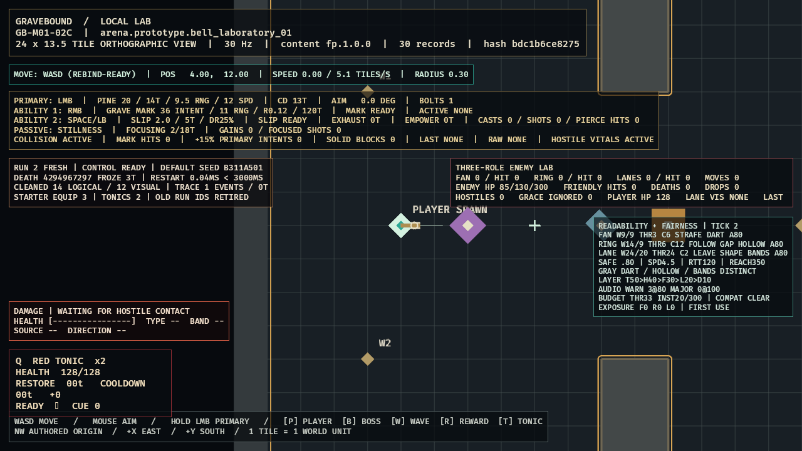

`GB-M01-06A` makes local death a one-shot transaction: health zero freezes the old run, retains the lethal trace, destroys all run-owned entities/items/stacks, and rejects later actions. Explicit Run Again reconstructs a full-health successor from validated content with the default seed, exact starter loadout, two Tonics, and new run-qualified identities; measured control return is below three seconds. See the [completion audit](docs/milestones/GB-M01-06A-audit.md).

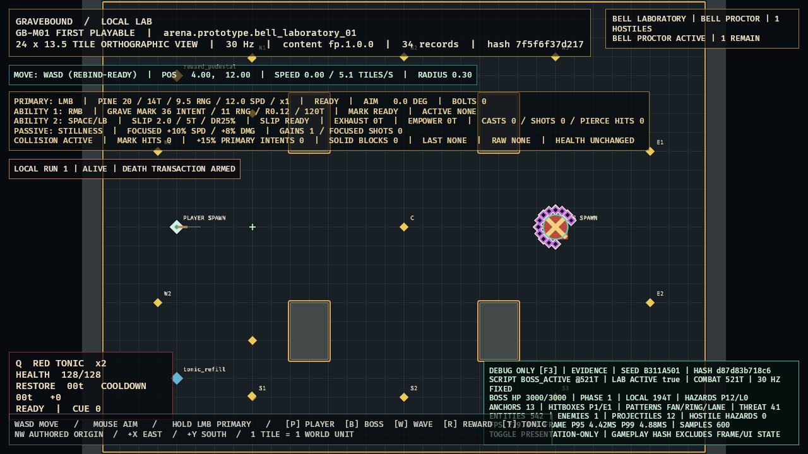

The complete local journey now advances through the three authored waves into the real Bell Proctor composite. Its content-authored scheduler drives live fan, rotating-gap ring, Cross lanes, phase breaks, damage, defeat, boss reward, completion summary, and atomic Run Again flow. See the [`04B`](docs/milestones/GB-M01-04B-audit.md), [`04C`](docs/milestones/GB-M01-04C-audit.md), and [`06B`](docs/milestones/GB-M01-06B-audit.md) audits.

### GB-M03 private-loop world foundation

| Realm Gate presentation keeps normal admission fail closed | The capacity-one microrealm requests the exact 900 ms warning without constructing `03D` enemies |
|---|---|
| 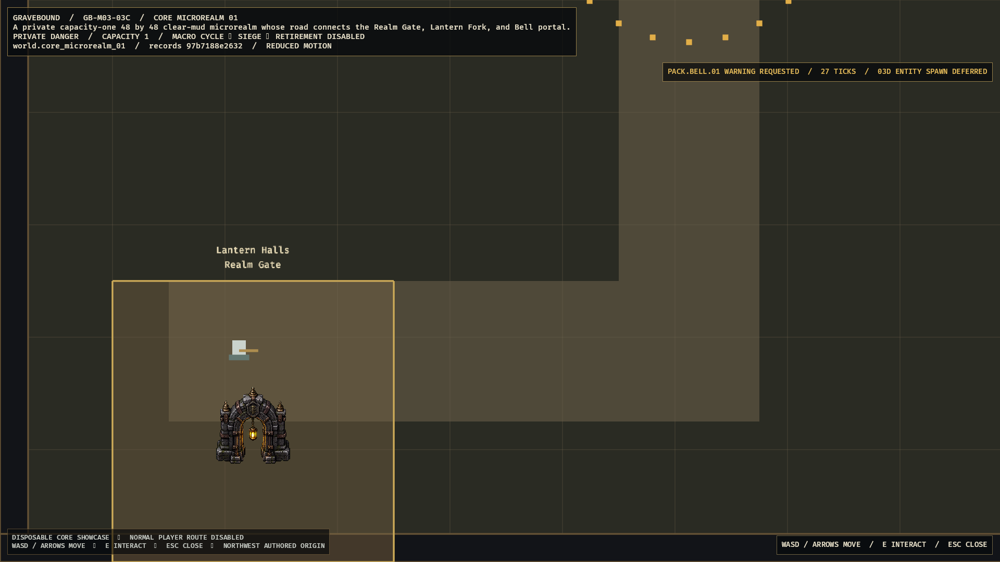 | 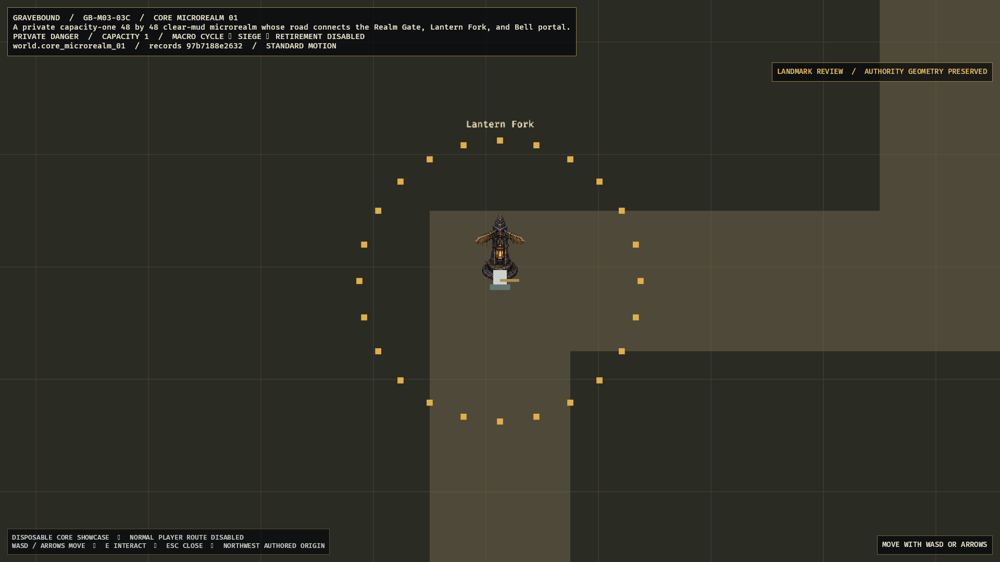 |

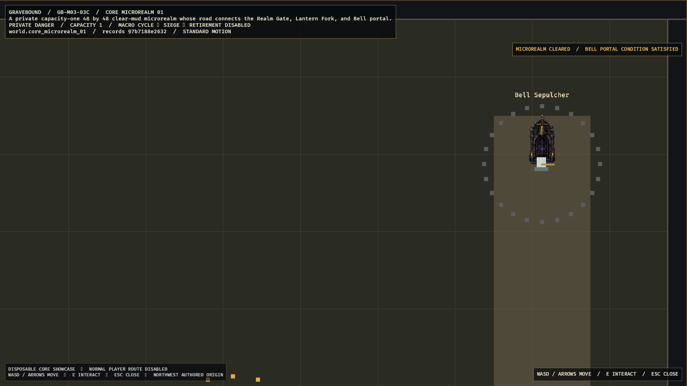

The native route is compiled from the exact Core world records and localization. Fixed-point collision/navigation, server-owned interaction projection, camera bounds, standard/reduced-motion presentation, and the Dormant -> Waiting -> Active -> Cleared lifecycle remain deterministic. Three stable object IDs resolve to hash-locked presentation art in the disposable showcase while their compiled geometry remains visible and authoritative; see the [visual manifest](docs/evidence/GB-M03-03G-microrealm-landmark-visual-manifest.md). The persistent live owner accepts action state only and derives its own frame tick, equipment-speed displacement, combat/collision, exact Bell wave, clear projection, and Slipstep under one rollback-safe route compare-and-swap; see the [combat](docs/evidence/GB-M03-03G-live-microrealm-combat-evidence.md) and [Slipstep evidence](docs/evidence/GB-M03-03G-live-slipstep-evidence.md). The retained owner now runs on an exclusive independent 30 Hz driver across `LinkLost` and reconnect; see the [driver evidence](docs/evidence/GB-M03-03G-independent-microrealm-driver-evidence.md). Two unregistered, provenance-complete review packs now cover all six Core normal-enemy silhouettes; none changes runtime registration or content hashes before optimized in-engine review. The normal player route remains disabled until fixed B0-B6 combat, rewards, pending inventory, and all terminal producers are composed through the persistent session.

### GB-M03 native transition and recovery

| Server-owned LinkLost boundary | Committed extraction returns to Hall |
|---|---|
| 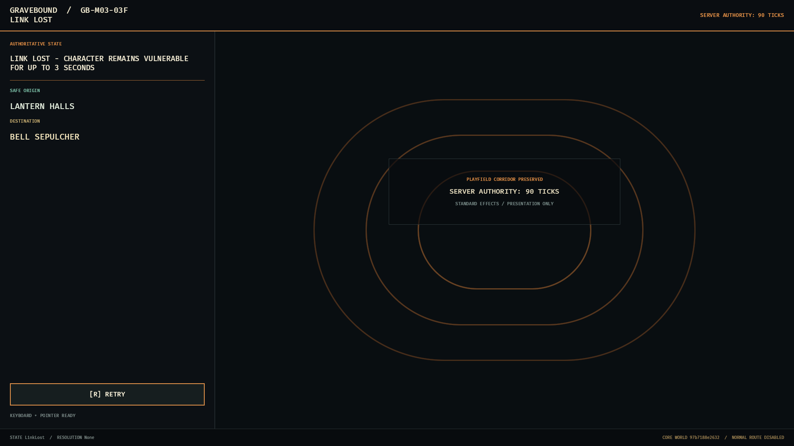 | 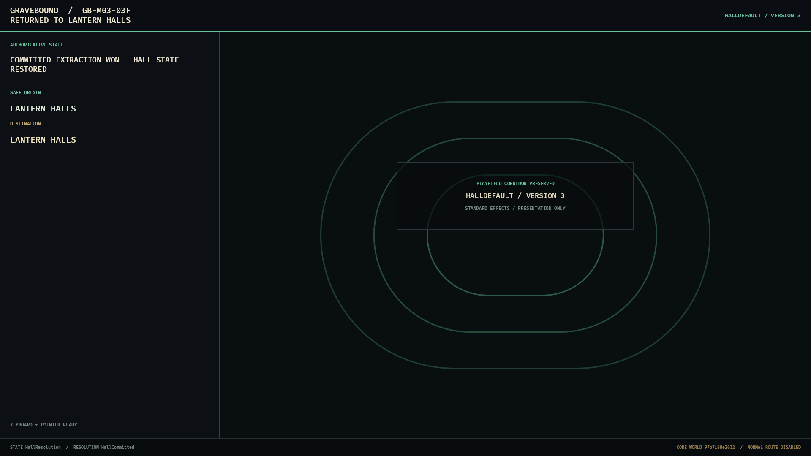 |

The strict Core transition projection preserves the last authoritative state, safe origin, destination, exact retry policy, and committed terminal result without predicting server outcomes. Its optimized 33-frame standard/reduced-effects matrix covers all eight required states at 1280x720 and 1920x1080 plus an ultrawide reference; see the [visual evidence manifest](docs/evidence/GB-M03-03F-visual-manifest.md). Normal route admission and Core promotion remain disabled.

### GB-M03 durable item and Vault lifecycle

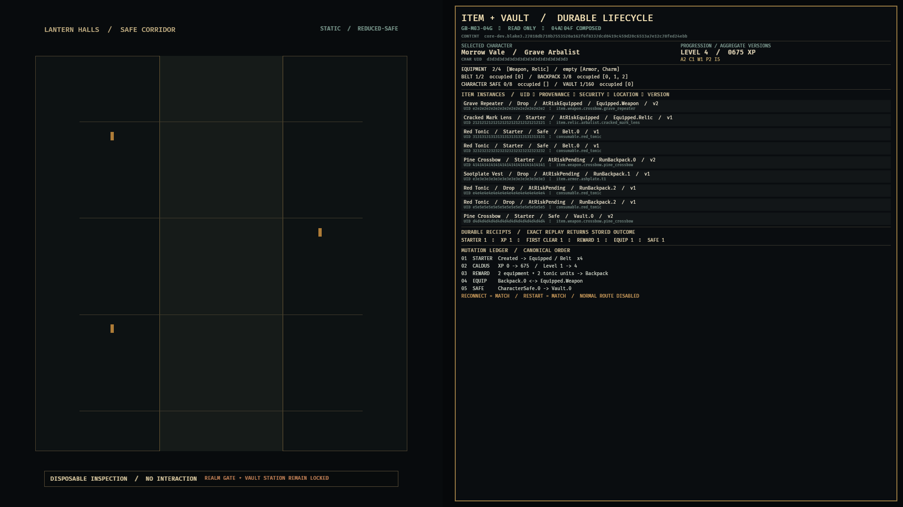

The disposable native inspection surface composes the completed `04A`-`04F` authorities into one content-bound signature: selected character, progression, exact storage capacities and occupancy, durable item identities and provenance, security/location state, aggregate versions, receipts, and the ordered mutation ledger. It remains read-only and preserves 49% of the viewport for the Hall corridor; Realm Gate, Vault station, and the normal route remain disabled. See the [visual evidence manifest](docs/evidence/GB-M03-04G-visual-manifest.md).

### GB-M03 durable death and Memorial presentation

| Durable death summary | Read-only Memorial Wall |
|---|---|
| 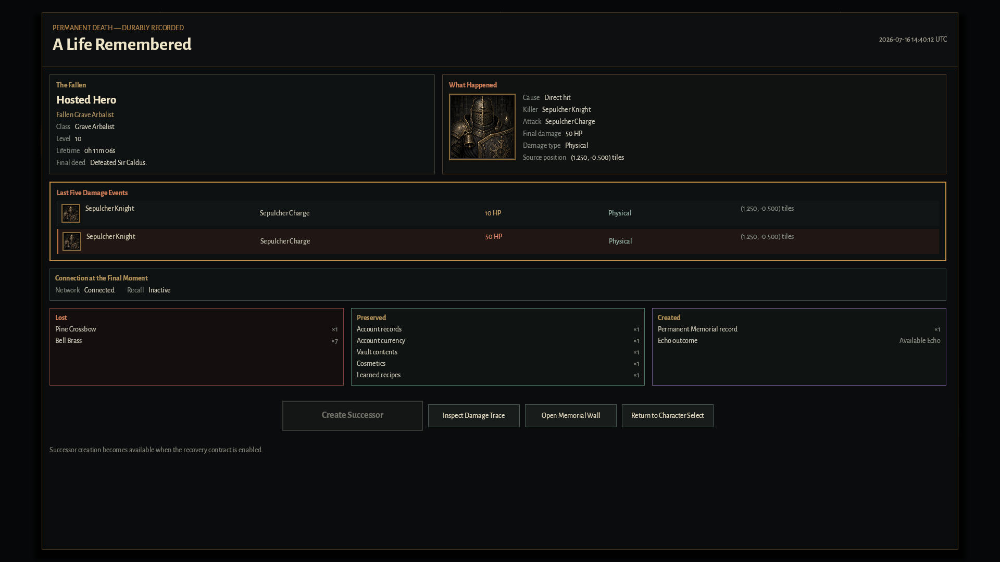 |  |

The native Bevy surfaces consume only the durable, content-revision-bound client projection. The summary preserves exact `DTH-020` order, shows the stored Echo outcome, supports bounded focus-follow scrolling at 1280x720, and keeps `Create Successor` disabled until `GB-M03-07`. Memorial rows retain raw cursor authority and open their own immutable stored snapshot without a gameplay mutation. The optimized [presentation matrix](docs/evidence/GB-M03-06D-visual-manifest.md), final [source-driven integration evidence](docs/evidence/GB-M03-06E-integrated-evidence.md), and [parent completion audit](docs/milestones/GB-M03-06-audit.md) cover standard/reduced effects, both target resolutions, exact replay/restart, adverse PostgreSQL/QUIC behavior, latency, and soak.

### GB-M03 successor recovery

| Durable `Create Successor` focus | Exact preselected successor |
|---|---|
| 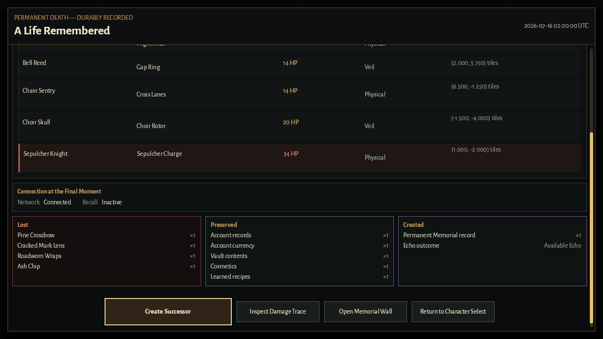 | 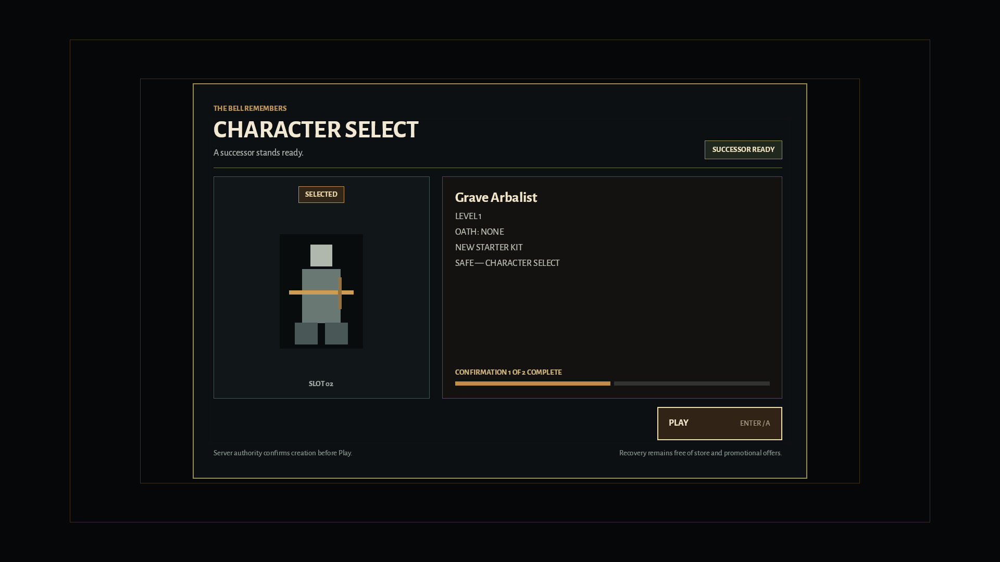 |

The evidence-only native coordinator joins the durable terminal proof, exact stored successor result, preselected Character Select, accepted Hall transfer, and matching scene readiness without enabling the shipped normal route. The [32-frame optimized visual matrix](docs/evidence/GB-M03-07-successor-visual-manifest.md) covers every recovery phase, both certified resolutions and effects modes, and 150% Character Select scale. The [hosted 25-journey report](docs/evidence/GB-M03-07-successor-recovery-manifest.md) passes timing, unique identity/grant, danger-return, and zero-residue gates; the [three-authority audit](docs/milestones/GB-M03-07-audit.md) closes the package. Normal Play and production Realm Gate admission remain fail closed until parent `GB-M03-03` integration passes.

### GB-M03 Resolution Hold recovery

| Full storage keeps Move disabled | Permanent destruction defaults to Cancel |
|---|---|
| 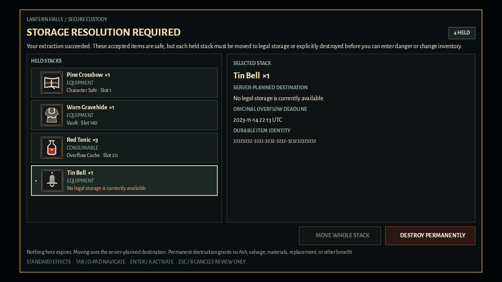 | 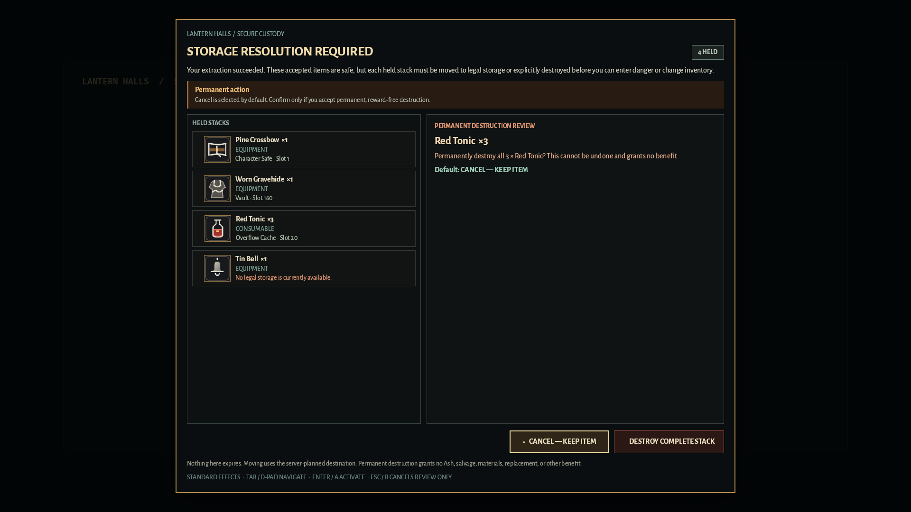 |

The blocking native surface consumes only negotiated server authority and the compiled Core item catalog. It shows exact whole-stack quantities, durable identities, one-based server-planned destinations, retained Overflow deadlines, typed retry state, and final-refresh acknowledgement without exposing a route-to-play escape. The optimized [24-frame visual manifest](docs/evidence/GB-M03-08-hold-visual-manifest.md) covers six states in standard and reduced effects at both target resolutions; the separate PostgreSQL/real-QUIC precedence and cleanup gates are closed in the [integrated evidence](docs/evidence/GB-M03-08-integrated-evidence.md).

## Technical direction

- Rust stable and Bevy 0.19.
- Native Windows client.
- Fixed 30 Hz authoritative simulation.
- Server-authoritative modular monolith before service decomposition.
- PostgreSQL persistence with idempotent item, death, extraction, and purchase transactions.
- Immutable, versioned content bundles with deterministic RNG and golden fixtures.
- Generated JSON checked into the future implementation repository; undocumented runtime defaults are prohibited.

## Visual direction

Dark-fantasy pixel art uses wet stone, tarnished brass, ash, salt, bone, moss, candlelight, and restrained stained glass. Environments remain muted so hostile projectiles, telegraphs, exits, safe zones, and player silhouettes retain priority.

| Lantern Halls nexus | Characters, enemies, weapons, and projectiles |
|---|---|
|  |  |

Latest M03 boss-route reviews (static review mocks, not native captures):

| B5 → B6 staging, countdown, and introduction | Defeat and reward authority states |
|---|---|
| 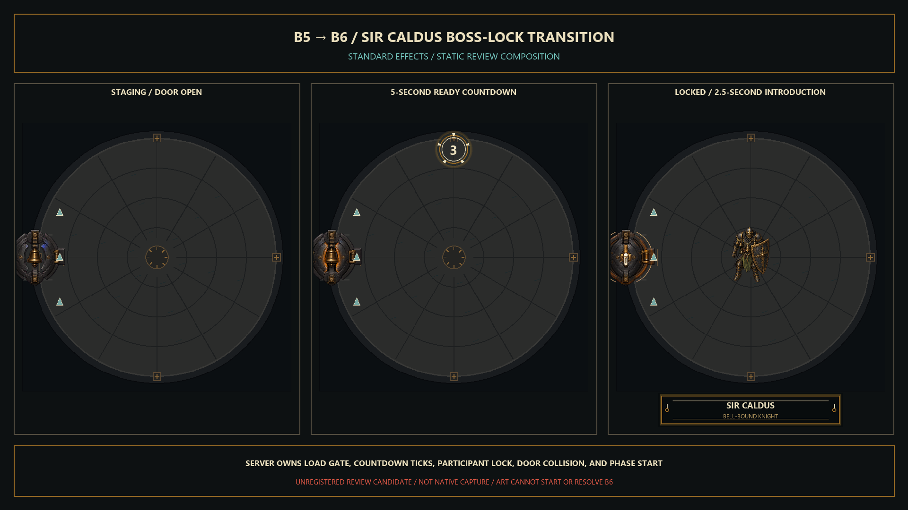 | 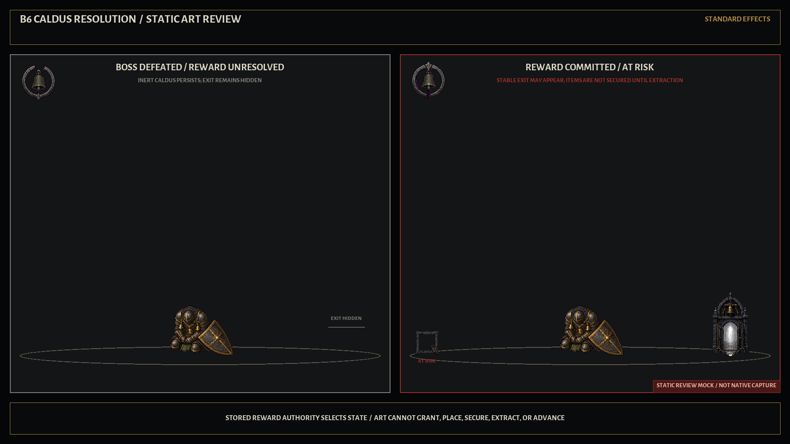 |

Concept images establish mood, hierarchy, and visual language. They are not final production sprites or promises of exact layout.

## Repository policy

- The canonical GDD and content specification require review together when gameplay data changes.
- Stable content IDs are never silently repurposed.
- No implementation may invent missing production rules; ambiguity becomes a specification change.
- Version 1.0 content implementation remains blocked until an exact Content Production Specification v2 is approved.
- Test progress is wipeable until the documented Early Access live-namespace cutover.

## Current Next Step

The Caldus-to-extraction worker and [live authoritative tick contract](docs/evidence/GB-M03-03G-live-authoritative-tick-evidence.md) are green through hosted run [`29668693282`](https://github.com/MikeyPar/Gravebound/actions/runs/29668693282), including Linux quality gates, PostgreSQL, Windows release, and optimized native death frames. Commits `06ef41f` and `bb67be7` add the reviewed [live player-damage fact boundary](docs/evidence/GB-M03-03G-live-player-damage-evidence.md): applied hits across microrealm, fixed dungeon, and Caldus now retain canonical tick/order/source/target/health/origin authority and fail closed before route commit when incoherent. Next add a lossless acknowledged driver-to-terminal feed, then compose live lethal death, the five-producer terminal loop, clocks/deeds/custody, danger activation, and ordinary dispatch before normal admission opens.

### Historical cumulative record

[`GB-M03-08`](docs/tasks/GB-M03-08.md) is complete under its [three-authority audit](docs/milestones/GB-M03-08-audit.md) and [integrated evidence](docs/evidence/GB-M03-08-integrated-evidence.md). Hosted CI [`29554811453`](https://github.com/MikeyPar/Gravebound/actions/runs/29554811453) is green for the exact audited source, including PostgreSQL, real QUIC, strict lint/tests/content validation, and optimized Windows construction.

The three-authority parent audit accepted [`ADR-037`](docs/decisions/ADR-037-normal-core-private-route-composition.md) under the route contract already approved by [`SPEC-CONFLICT-006`](docs/spec-conflicts/SPEC-CONFLICT-006-m03-world-flow-contract.md). Exact source `e069987` is green under hosted CI [`29633952947`](https://github.com/MikeyPar/Gravebound/actions/runs/29633952947) for the dormant persistent foundation, generation-safe shared-writer session/Recall ownership, PostgreSQL transactions, strict Linux quality/content/schema checks, optimized Windows construction, and native evidence. Commit `cf933f2` adds the dynamic extraction runtime on that shared writer. Publication requires an opaque five-producer executor proof and complete time/tick/version authority; the actor samples its generation-bound tick only after command dequeue; delivery remains live through caller cancellation and emits once; exact retries and handoffs are replayed; Hall installation consumes an exact generation/terminal/result token; all competing terminal winners retire extraction without closing the Hall writer; shutdown retires route actors and reports residue. Local formatting, 9/9 extraction-intent tests, 11/11 extraction execution tests, the complete 286-test server suite, all workspace targets, and strict workspace all-target Clippy pass; the independent authority re-audit found no remaining runtime blocker. Commit `a30e644` adds the terminal-first process bootstrap adapter and post-commit/replayed world-flow reconciliation: first-time identity defers cleanly; Character Select and storage-blocked states create no route actor; restart danger atomically restores to Hall or yields to a committed terminal; Hall generations are durable and reused in-process; stored death/extraction/Recall outcomes remain ordered before destination control; and exact Hall/microrealm/Character Select transition replays converge without rewind while changed material fails closed. Corrective commit `51be807` withholds extraction and Recall Hall actors until the exact stored terminal result is delivered and acknowledged; restart never invents extraction request correlation or exposes destination control first. Focused bootstrap tests pass 5/5, route-actor tests pass 11/11, the complete 293-test server suite and all server targets pass, and strict server all-target Clippy is green. Commit `93dde0a` unifies dynamic Recall, extraction, and restart recovery on the private-life session's single writer: symmetric two-phase handoffs are recoverable and exact; reconnect rebinds both owners before visibility; only the session retires shared transports; stored Explicit/LinkLost Recall and exact extraction retries remain account/character/content/version bound; current outer ticks and stored inner correlation are preserved; and Hall remains gated behind exact terminal delivery. Real-QUIC composition proves one writer identity, contiguous sequences `1/2/3` per transport, stale-detach safety, coordinated reconnect, and zero residue. Local formatting/diff checks, strict server/workspace all-target Clippy, 301/301 server library tests, all workspace tests, four content validators, and generated-schema verification pass. Commit `45c8bcb` integrates the provenance-complete, hash-locked Realm Gate, Lantern Fork, and Bell Sepulcher art into the optimized disposable microrealm at both certified resolutions and effects modes without changing compiled authority or normal admission. Commit `37cf99d` adds rollback-safe live microrealm movement, lifecycle, server-clear, and Bell-range ownership; focused tests cover the complete spawn-to-Bell route and stale-authority rollback. Commit `736cb59` adds provenance-complete Drowned Pilgrim, Bell Reed, and Chain Sentry candidates; keep them outside runtime/content hashes until optimized B1/B5 telegraph and anchor review passes. Commit `e5e1a9b` binds the live microrealm owner and exact route lease to the persistent account session: reconnect receives the same allocation before visibility, stale transports are denied, `LinkLost` preserves danger authority, exact unbind leaves the shared writer alive, and shutdown reports zero residue. Formatting, strict server all-target Clippy, `306/306` server library tests, every enabled server target, and focused real-QUIC handoff/reconnect proof pass locally. Commits `302ccb3`, `f07a282`, and `587924e` now extract the lifecycle-free `pack.bell.01` owner, move the single mutable character-combat allocation through an exact rejoin envelope, and remove tick/displacement/damage/clear authority from ingress. Each invoked frame generates the next tick, equipment-speed displacement, player combat/collision, hostile wave step, and exact clear projection under one staged route compare-and-swap. Strict all-feature/all-target Clippy, all `125/125` simulation tests, and all `309/309` server tests pass locally. Cumulative hosted run [`29639908490`](https://github.com/MikeyPar/Gravebound/actions/runs/29639908490) is green for exact source `587924e`, including the prior pack and handoff commits. Commits `ffd74d6` and `370b53e` add provenance-complete Bell VFX and pending-loot risk candidates; both remain outside registries and content/runtime hashes pending optimized in-engine review. Commits `f75c662`, `8d74ca7`, and `3c6af83` now compose exact compiled-shell movement and Slipstep in the same rollback-safe live combat frame; local `388/388` simulation-core, `126/126` content, `310/310` server, formatting, and strict all-feature/all-target Clippy gates pass. Commit `ea6445c` adds verified unregistered B0/B4/B6 landmark candidates without changing registry or content authority. Hosted CI runs [`29640683239`](https://github.com/MikeyPar/Gravebound/actions/runs/29640683239), [`29640707913`](https://github.com/MikeyPar/Gravebound/actions/runs/29640707913), and [`29640811604`](https://github.com/MikeyPar/Gravebound/actions/runs/29640811604) are green for the Slipstep, landmark, and evidence sources. Commits `c3bc57e`, `995151c`, and `4516b1a` move input validation to session ingress, exclusively own the runtime behind a one-slot/reliable-action 30 Hz driver, preserve danger ticks with LinkLost neutralization, freeze exact terminal/fault frames, retain one generation-safe observer across reconnect, and join through a transport-independent binding lease. Local paused-time tests pass `5/5`, the cumulative server suite passes `315/315`, and strict all-target/all-feature Clippy is green; hosted run [`29641751122`](https://github.com/MikeyPar/Gravebound/actions/runs/29641751122) was still in progress at the latest poll and is not yet claimed green. Commits `42d9f85` and `9694790` provide fail-closed completed-room handoffs and one lifecycle-free B0-B6 owner; commits `5deee6d`, `f044a61`, and `6749141` add collision-safe room entry, continuous hostile identities, exact Bell version/tick/player/projectile handoff, and atomic persistent route CAS; commit `a2a5b09` now converts the runtime inside the existing session-owned 30 Hz task, freezes unknown durable outcomes, survives acknowledgement loss, and preserves one observer/writer across reconnect; commits `d63b675` and `8d62f6f` add unregistered Caldus Stop Ring and defeat candidates. Commits `b50a8c0` and `09c9c9e` now generate server-owned fixed-room movement/combat frames inside that same task, preserve tick/input/player/route identity across B1 and reconnect, reject stale transports and early advances without faulting, and freeze lethal/fault states; local strict Clippy, `131/131` sim-content tests, `326/326` server library tests, every enabled server target, and focused real-QUIC proof pass. Commit `a6fb62e` adds an unregistered, provenance-complete B4 `Open`/`Selected`/`Refused` shrine-state review pack outside runtime hashes. Commit `e1e4d7c` binds committed/replayed `Selected`, `Refused`, and authoritative no-offer B4 results to the same session task through an opaque account/character/lineage receipt; local `242/242` persistence and `330/330` server tests plus strict all-target/all-feature Clippy pass, while hosted run [`29648007340`](https://github.com/MikeyPar/Gravebound/actions/runs/29648007340) remains pending. Next, commit the B3 reward and milestone result through the normal coordinator before B4 response delivery, then implement the B5 bridge, Sir Caldus at B6, durable personal rewards/pending inventory, the stable B6 exit, and all five terminal producers. Keep `core_world_flow_integration`, Character Select `Play`, Realm Gate interaction, and normal extraction/Recall admission disabled until fixed-room combat, rewards, pending inventory, all terminal owners, real-QUIC restart/25-journey evidence, and visual review pass. Keep Core promotion, M04+ content, telemetry, support, hosting/platform surfaces, and unrelated Hall stations fail closed. The unregistered Sir Caldus [attack-motion](assets/core/bosses/sir_caldus/review/v2/README.md), [idle/recovery](assets/core/bosses/sir_caldus/review/v3/README.md), [Bell Ring](assets/core/bosses/sir_caldus/review/v4/README.md), [Charge Stop Ring](assets/core/bosses/sir_caldus/review/v5/README.md), [defeat transition](assets/core/bosses/sir_caldus/review/v6/README.md), and [reward-state](assets/core/ui/caldus_resolution_states/v1/README.md) review packs remain outside runtime hashes pending combined in-engine timing, attack-origin/hurtbox/collision, reward ordering, pending-risk readability, anchor drift, opposite-gap readability, and optimized native review.

## Resolved prior handoff

The owner approved the in-place `fp.1.0.0` correction. The subsequent full reference-loadout audit corrected the earlier omitted-armor premise, retained the raw-12 fan as Chip, and closed both Bell specification conflicts. The resulting Bell, combat, summary, and debug tickets pass locally; this paragraph is retained only as the resolved decision record.
