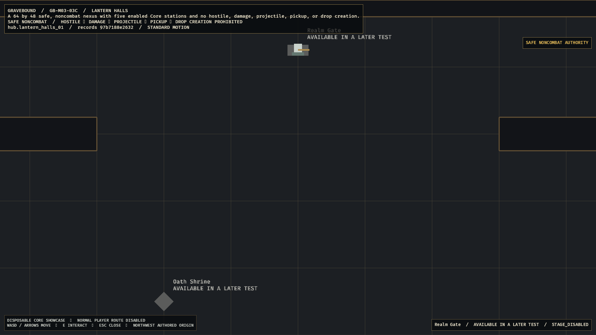
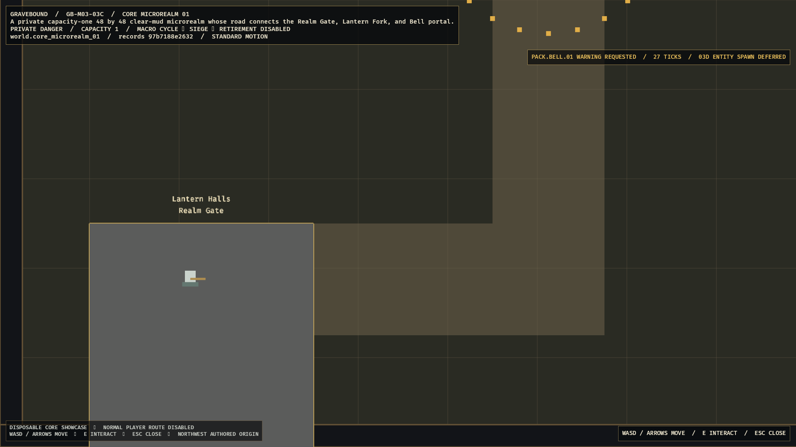
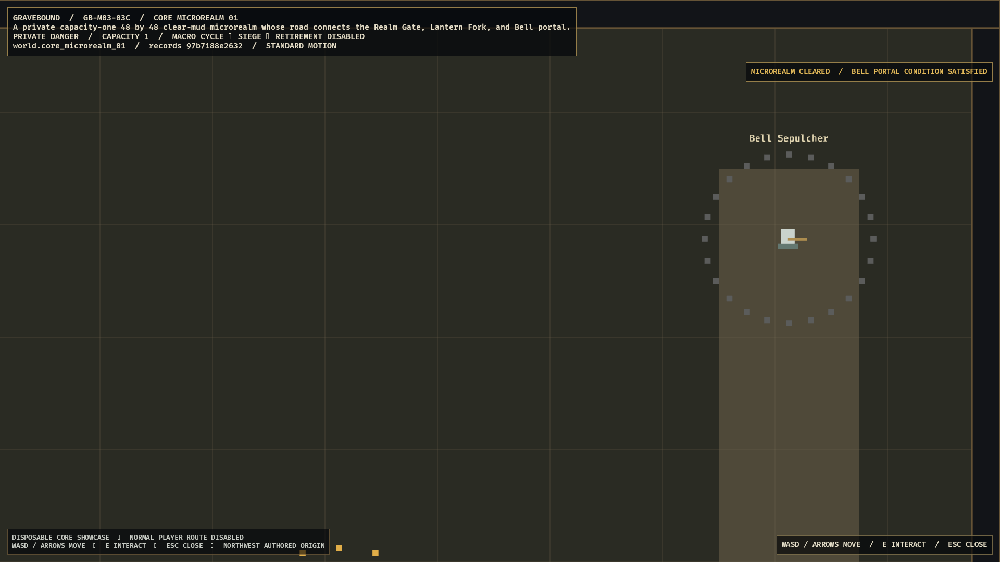

# Gravebound

Gravebound is a server-authoritative, permanent-death, 2D dark-fantasy bullet-hell dungeon crawler inspired by the immediacy and social danger of *Realm of the Mad God*.

Every character life is temporary. The account remembers what happened, and exceptional deaths can return as personalized Fallen Hero Echo encounters. The design emphasizes readable combat, rapid recovery, fair monetization, solo viability, and long-term replayability without permanent account-level combat power.

> **Project status:** M01 and M02 are closed under their recorded gates. M03 has closed identity, parent PostgreSQL persistence, exact world-flow content, atomic dormant transfers, Hall/private-microrealm simulation and native evidence, progression, the complete Core 18-item/equipment/CharacterSafe/Vault lifecycle, the first Oath/Bargain package, the minimal Ash wallet, and atomic death/destruction/Memorial/Echo persistence with hosted adverse, outage, response-loss, restart, soak, and native evidence. Parents `GB-M03-02`, `GB-M03-04`, and `GB-M03-06` are complete. `GB-M03-08` has hosted-green append-only protocol `1.16`, terminal migrations `0055`-`0059`, extraction/Recall persistence and dispatch, exact server-owned 12-tick explicit/90-tick LinkLost coordination, bounded per-character serialization, the staged five-producer terminal driver, and a hosted-green disposable Recall route. ResolutionHold now has a deterministic whole-stack planner, bounded canonical wire/domain/read authority, immutable extraction provenance, legal server-owned destination previews, a replay-first serializable Move/DestroyConfirmed writer, and authenticated fail-closed Hall service/dispatch. Commits `29aa708`, `6135e7f`, `d0cb29f`, and `92269c2` replace invalid direct Overflow setup with real production extraction journeys and complete their entry/reward lineage; the mandatory PostgreSQL gate in hosted run [`29546447105`](https://github.com/MikeyPar/Gravebound/actions/runs/29546447105) is green. Commit `409a0b3` binds requests to the authenticated account and selected character, rejects mismatched stored authority before projection, and preserves exact replay/conflict results. Commit `25db56c` routes both Hold frame types and proves the normal endpoint omits and rejects the capability. Commit `dc1deb0` adds disposable persistent query, typed missing-stack rejection, and exact pool-restart QUIC evidence; hosted run [`29547218935`](https://github.com/MikeyPar/Gravebound/actions/runs/29547218935) is validating it. Commit `c9953db` adds an injectable production-shaped authority seam and proves positive stack preview, fresh Move, identical replay, and altered conflict over real QUIC; hosted run [`29547725523`](https://github.com/MikeyPar/Gravebound/actions/runs/29547725523) is validating it. Native Hold presentation, remaining adverse/cleanup evidence, successor recovery, complete-route admission, telemetry, support, platform evidence, and final private-loop/cohort gates remain disabled.

## Design package

| Document | Purpose |
|---|---|
| [Canonical Production GDD](Gravebound_Production_GDD_v1_Canonical.md) | Product contract, gameplay systems, architecture, economy, monetization, UI, art direction, QA, and release gates |
| [Content Production Specification](Gravebound_Content_Production_Spec_v1.md) | Exact IDs, formulas, encounters, rooms, loot tables, boss schedules, manifests, cosmetics, localization, and validation rules |
| [Development Roadmap](Gravebound_Development_Roadmap_v1.md) | Gate-based delivery plan from First Playable through Early Access and Version 1.0 |
| [Original Ashen Veil GDD](Gravebound_Ashen_Veil_GDD.html) | Preserved source design used to produce the canonical package |
| [M00 Completion Audit](docs/milestones/GB-M00-audit.md) | Reproducibility, validation, deterministic trace, clean CI, and Windows release evidence |

The canonical GDD defines intent and product rules. The content specification is the executable authority for exact gameplay data. The roadmap controls sequencing and promotion gates.

## Core experience

- Top-down orthographic movement with independently aimed weapons.
- Dense but strongly telegraphed projectile combat.
- Permanent character death with fast successor creation.
- Four equipment slots: Weapon, Relic, Armor, and Charm.
- Optional Veil Bargains that pair a meaningful boon with a meaningful curse.
- Personal Fallen Hero Echoes assembled from notable dead characters.
- Public realm events, authored-room dungeons, minibosses, and major bosses.
- Solo-completable progression with parties and public encounters as optional advantages.
- Cosmetics-only commercial model: no paid power, storage, slots, access, or death protection.

## Early Access target

| Category | Scope |
|---|---|
| Classes | Ashen Vanguard, Grave Arbalist, Veil Witch; two oaths each |
| World | Lantern Halls nexus and the Mire of Bells public realm |
| Dungeons | Bell Sepulcher, Root Chapel, Drowned Reliquary |
| Encounters | 18 normal enemies, 6 minibosses, 3 dungeon bosses, Bell Warden world climax |
| Items | 90 templates, 29 affixes, 12 Black Uniques |
| Replay systems | 12 Veil Bargains, 6 dungeon modifiers, personal Requiem encounters |
| Groups | Solo to 8-player dungeons; 40-player realm cap |
| Platform | Native Windows 10/11 release through Steam |

## Fastest playable path

The first milestone intentionally excludes accounts, networking, the public realm, crafting, and commerce. It proves the feel of the game before expensive infrastructure work begins.

The 10-day First Playable contains:

- Grave Arbalist.
- One fixed combat arena.
- Drowned Pilgrim, Bell Reed, and Chain Sentry.
- Bell Proctor benchmark boss.
- Twelve prototype equipment templates and Red Tonic.
- Local movement, aiming, shooting, abilities, loot, death, and immediate restart.

Development proceeds only when the milestone's playability, fairness, reliability, and retention gates pass. See the [Development Roadmap](Gravebound_Development_Roadmap_v1.md) for the complete sequence.

### Current implementation

`GB-M01-06A` makes local death a one-shot transaction: health zero freezes the old run, retains the lethal trace, destroys all run-owned entities/items/stacks, and rejects later actions. Explicit Run Again reconstructs a full-health successor from validated content with the default seed, exact starter loadout, two Tonics, and new run-qualified identities; measured control return is below three seconds. See the [completion audit](docs/milestones/GB-M01-06A-audit.md).

The complete local journey now advances through the three authored waves into the real Bell Proctor composite. Its content-authored scheduler drives live fan, rotating-gap ring, Cross lanes, phase breaks, damage, defeat, boss reward, completion summary, and atomic Run Again flow. See the [`04B`](docs/milestones/GB-M01-04B-audit.md), [`04C`](docs/milestones/GB-M01-04C-audit.md), and [`06B`](docs/milestones/GB-M01-06B-audit.md) audits.

### GB-M03 private-loop world foundation

| Lantern Halls keeps Realm Gate admission fail closed | The capacity-one microrealm requests the exact 900 ms warning without constructing `03D` enemies |
|---|---|
|  |  |

The native graybox is compiled from the exact Core world records and localization. Fixed-point collision/navigation, server-owned interaction projection, camera bounds, standard/reduced-motion presentation, and the Dormant -> Waiting -> Active -> Cleared lifecycle are deterministic; the normal player route remains disabled until its item, death, extraction, and Recall owners pass. See the [`03C`](docs/milestones/GB-M03-03C-audit.md) and [`03F`](docs/milestones/GB-M03-03F-audit.md) completion audits.

### GB-M03 native transition and recovery

| Server-owned LinkLost boundary | Committed extraction returns to Hall |
|---|---|
|  |  |

The strict Core transition projection preserves the last authoritative state, safe origin, destination, exact retry policy, and committed terminal result without predicting server outcomes. Its optimized 33-frame standard/reduced-effects matrix covers all eight required states at 1280x720 and 1920x1080 plus an ultrawide reference; see the [visual evidence manifest](docs/evidence/GB-M03-03F-visual-manifest.md). Normal route admission and Core promotion remain disabled.

### GB-M03 durable item and Vault lifecycle

The disposable native inspection surface composes the completed `04A`-`04F` authorities into one content-bound signature: selected character, progression, exact storage capacities and occupancy, durable item identities and provenance, security/location state, aggregate versions, receipts, and the ordered mutation ledger. It remains read-only and preserves 49% of the viewport for the Hall corridor; Realm Gate, Vault station, and the normal route remain disabled. See the [visual evidence manifest](docs/evidence/GB-M03-04G-visual-manifest.md).

### GB-M03 durable death and Memorial presentation

| Durable death summary | Read-only Memorial Wall |
|---|---|
|  |  |

The native Bevy surfaces consume only the durable, content-revision-bound client projection. The summary preserves exact `DTH-020` order, shows the stored Echo outcome, supports bounded focus-follow scrolling at 1280x720, and keeps `Create Successor` disabled until `GB-M03-07`. Memorial rows retain raw cursor authority and open their own immutable stored snapshot without a gameplay mutation. The optimized [presentation matrix](docs/evidence/GB-M03-06D-visual-manifest.md), final [source-driven integration evidence](docs/evidence/GB-M03-06E-integrated-evidence.md), and [parent completion audit](docs/milestones/GB-M03-06-audit.md) cover standard/reduced effects, both target resolutions, exact replay/restart, adverse PostgreSQL/QUIC behavior, latency, and soak.

## Technical direction

- Rust stable and Bevy 0.19.
- Native Windows client.
- Fixed 30 Hz authoritative simulation.
- Server-authoritative modular monolith before service decomposition.
- PostgreSQL persistence with idempotent item, death, extraction, and purchase transactions.
- Immutable, versioned content bundles with deterministic RNG and golden fixtures.
- Generated JSON checked into the future implementation repository; undocumented runtime defaults are prohibited.

## Visual direction

Dark-fantasy pixel art uses wet stone, tarnished brass, ash, salt, bone, moss, candlelight, and restrained stained glass. Environments remain muted so hostile projectiles, telegraphs, exits, safe zones, and player silhouettes retain priority.

| Lantern Halls nexus | Characters, enemies, weapons, and projectiles |
|---|---|
|  |  |

Concept images establish mood, hierarchy, and visual language. They are not final production sprites or promises of exact layout.

## Repository policy

- The canonical GDD and content specification require review together when gameplay data changes.
- Stable content IDs are never silently repurposed.
- No implementation may invent missing production rules; ambiguity becomes a specification change.
- Version 1.0 content implementation remains blocked until an exact Content Production Specification v2 is approved.
- Test progress is wipeable until the documented Early Access live-namespace cutover.

## Current Next Step

Parents [`GB-M03-02`](docs/milestones/GB-M03-02-audit.md), [`GB-M03-04`](docs/milestones/GB-M03-04-audit.md), and [`GB-M03-06`](docs/milestones/GB-M03-06-audit.md), plus atomic Echo package [`GB-M03-13`](docs/milestones/GB-M03-13-audit.md), are complete. Hosted CI [`29506273492`](https://github.com/MikeyPar/Gravebound/actions/runs/29506273492) is the final death/Echo acceptance. [`GB-M03-08`](docs/tasks/GB-M03-08.md) preserves old protocol bytes while appending extraction/Recall kinds `19`/`20` and Hold kinds `21`/`22`; extraction/Recall implementation is hosted green through [`29536980393`](https://github.com/MikeyPar/Gravebound/actions/runs/29536980393), Hold protocol through [`29537777576`](https://github.com/MikeyPar/Gravebound/actions/runs/29537777576), migrations through `0059` plus the bounded Hold read through [`29541316032`](https://github.com/MikeyPar/Gravebound/actions/runs/29541316032), persistent Hold dispatch through [`29547218935`](https://github.com/MikeyPar/Gravebound/actions/runs/29547218935), positive Hold mutation over real QUIC through [`29547725523`](https://github.com/MikeyPar/Gravebound/actions/runs/29547725523), and negotiated native feature authority through [`29548667235`](https://github.com/MikeyPar/Gravebound/actions/runs/29548667235). Commit `11ad56c` adds the reusable pure resolver with canonical correlation, current content binding, exact post-reconnect mutation replay, two-stage destructive confirmation, exhaustive typed failure policy, and final-clear refresh; run [`29549452058`](https://github.com/MikeyPar/Gravebound/actions/runs/29549452058) is validating it. Commit `1093849` adds typed, policy-free bot helpers for Hold query, mutation, and response-loss evidence; run [`29549661591`](https://github.com/MikeyPar/Gravebound/actions/runs/29549661591) is validating it. Commits `5febcfb` and `f61400b` add the content-safe projection and full-viewport Bevy overlay with compiled names/icons, exact quantities/UIDs, server destination/deadline copy, pointer/keyboard/gamepad focus, visible scrolling, and safe destructive defaults; runs [`29550043580`](https://github.com/MikeyPar/Gravebound/actions/runs/29550043580) and [`29550582319`](https://github.com/MikeyPar/Gravebound/actions/runs/29550582319) are validating them. Next, build the fixture probe and capture visual/input evidence, then close remaining terminal adverse/cleanup evidence before the `GB-M03-08` audit. Then complete `GB-M03-07` successor recovery and parent `GB-M03-03`; keep normal route admission and Core promotion fail closed.

## Resolved prior handoff

The owner approved the in-place `fp.1.0.0` correction. The subsequent full reference-loadout audit corrected the earlier omitted-armor premise, retained the raw-12 fan as Chip, and closed both Bell specification conflicts. The resulting Bell, combat, summary, and debug tickets pass locally; this paragraph is retained only as the resolved decision record.
