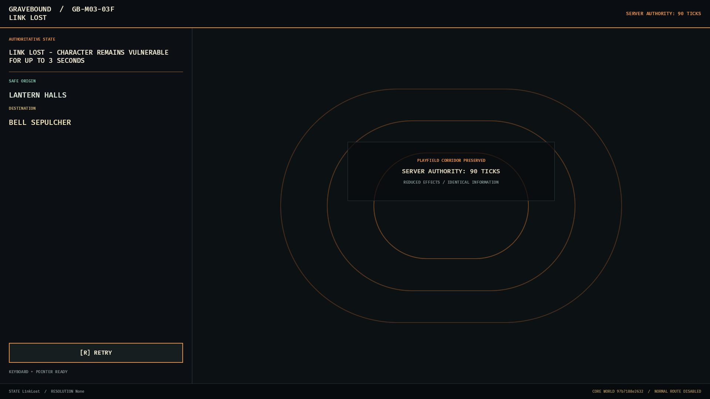

# GB-M03-03F native transition visual evidence

**Result:** Pass. The optimized native transition surface preserves its state/action hierarchy, safe-origin and destination context, keyboard focus, non-color status identity, copy wrapping, and protected playfield corridor across the required matrix.

## Authority and capture identity

- Product authority: `Gravebound_Production_GDD_v1_Canonical.md` (`UI-002`, `UI-003`, `UI-030`, `TECH-070`).
- Content authority: `Gravebound_Content_Production_Spec_v1.md` (strict unpromoted Core world identity, fixed route, and en-US package).
- Delivery authority: `Gravebound_Development_Roadmap_v1.md` (`GB-M03-03` and approved `03F` ownership).
- Source revision: `127edc2` (`fix(client): stabilize Core transition evidence`).
- Optimized executable SHA-256: `f0d73193c132bf755e1188350db7a12e9dbb9b895814bfda90f1a02312022312`.
- Core records BLAKE3: `97b7188e26329b9430b7289d1e17d347c9b9472863b7db6bd48501fd3b773158`.
- Capture host: Windows 10 Home 10.0.19045; Intel Core i7-10700K; AMD Radeon RX 6700 XT, driver 32.0.21043.19003; 64 GiB installed RAM.
- Capture method: independent optimized launches using the deterministic `GB-M03-03F` evidence scenario; 90 presentation-settle frames before capture.

## Matrix

Each state below has standard-effects and reduced-effects captures at 1280x720 and 1920x1080. `LinkLost` additionally has the required 2560x1080 ultrawide shell reference.

| State | Required proof |
|---|---|
| `HallLoading` | safe Hall origin, requested Hall destination, authoritative-state wait, no fabricated progress |
| `DungeonLoading` | safe Hall origin, Bell Sepulcher destination, preserved corridor |
| `RecoverableError` | prior safe state retained and exact retry action visible |
| `FatalError` | fatal identity without unsafe retry |
| `LinkLost` | server-owned 90-tick vulnerability boundary and retry focus |
| `Reconnecting` | same safe origin, attempt identity, and retry focus |
| `SameStateRecovery` | authoritative reattachment without terminal prediction |
| `HallResolution` | committed extraction wins and exact `HallDefault` version is shown |

The 33 PNG files use the closed naming scheme `GB-M03-03F-<state>-<mode>-<resolution>.png`. Original-resolution inspection found no clipping, overlap, ambiguous focus, color-only meaning, missing information in reduced effects, or protected-corridor intrusion. The ultrawide composition intentionally retains a bounded left rail and expands the preserved playfield rather than stretching the information hierarchy.

## Representative frames

| Server-owned LinkLost boundary | Committed Hall resolution |
|---|---|
|  |  |

Reduced effects communicates the same state and action in text while simplifying presentation:

## Scope boundary

These captures prove presentation only. They do not promote Core content or enable normal Character Select `Play`, Realm Gate admission, production inventory mutation, seeded branches, or the normal player route. Performance and 30-minute soak evidence remain separate `03F` gates.
