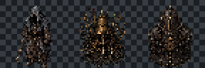

# GB-M03-03G Core Bell enemy art review v1

**Result:** Accepted as an unregistered runtime-candidate pack at source `736cb59`. Registration remains blocked on optimized live-combat readability evidence.

## Three design authorities

1. `Gravebound_Production_GDD_v1_Canonical.md`: `ENC-001`, `ENC-002`, `ART-001`, `ART-002`, `ART-004`, `ART-005`, `ART-020`, and `ART-030`.
2. `Gravebound_Content_Production_Spec_v1.md`: `CONT-ROOM-007`, `CONT-ENEMY-001`, `CONT-ENEMY-002`, and `CONT-PATTERN-001`.
3. `Gravebound_Development_Roadmap_v1.md`: the `GB-M03` private-loop scope and cumulative M03 asset/readability target.

## Accepted candidates

| Stable asset ID | Runtime file | Role | SHA-256 |
|---|---|---|---|
| `sprite.enemy.drowned_pilgrim` | `drowned-pilgrim.48.png` | narrow humanoid Fodder | `921edd2bf9c977d8f1761dd2976d1683723d0c96ca3a2f0c9c2180461b37f16b` |
| `sprite.enemy.bell_reed` | `bell-reed.48.png` | stationary reed-and-bell Pressure | `82110c794b8aa9b093f214c39d424db84daa8c647ab4df64393f24473ffcab50` |
| `sprite.enemy.chain_sentry` | `chain-sentry.48.png` | broad chained Anchor | `2d136687045ced6a3b62ff19fd1e86141a97cf96a3a4d586894b2c401b1e422f` |

Every runtime image is normalized RGBA 48x48 with bottom-center anchor `[24,48]`, transparent corners, nonempty alpha, nearest-neighbor pixel clusters, and no baked attack, projectile, telegraph, loot, exit, or safe-state effect. The 48 px and 96 px previews retain distinct narrow/fixture/broad silhouettes and restrained brass accents.

## Provenance and verification

- Source manifest: [`m03-core-bell-encounter-trio.v1.source.json`](../../assets/core/enemies/core_bell_encounter_trio/v1/m03-core-bell-encounter-trio.v1.source.json).
- Source manifest SHA-256: `d21b132b7de37af8e63dbf27dac2bc355d381a7fdf162a62920201d06189f5d0`.
- Source manifest BLAKE3: `447de8db2d5647402c168c6ed3cd615d925581b1dfeb72a932b9ae00046fa724`.
- All `11/11` recorded source, alpha, runtime, and preview SHA-256 values were recomputed and matched.
- Main-agent original-resolution inspection passed at 48 px and nearest-neighbor 96 px.

The manifest records the exact image-generation method, prompts, inspected in-project style reference, chroma-key process, normalization, source/runtime hashes, content dependencies, and commercial-rights review boundary.

## Remaining gate

The existing Core content records and hashes are unchanged. Before registration, render the trio in optimized native B1/B5 combat against the final dungeon background with authoritative fan/ring/Cross telegraphs and projectiles. Confirm player/hostile/effect priority, grayscale distinction, bottom-anchor alignment, hurtbox/attack-origin neutrality, and standard/reduced-effects parity. No candidate may become a route asset merely from this static review.
