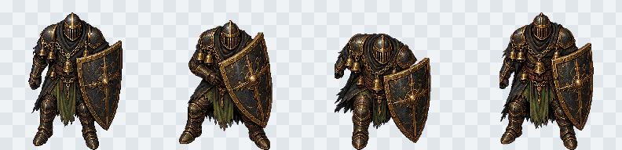
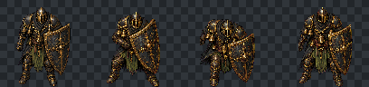
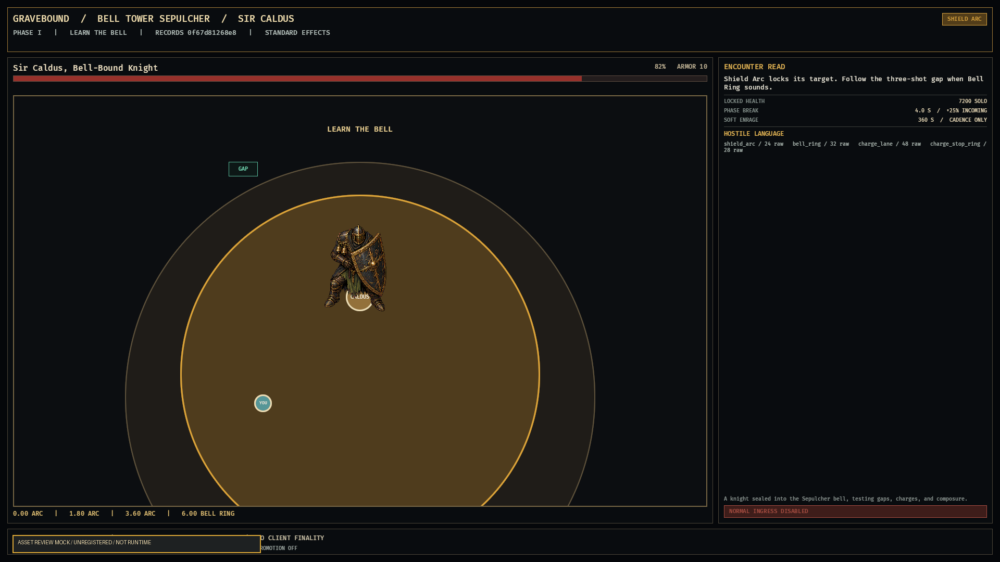

# GB-M03-03G Sir Caldus renderer-review pack v1

## Result

**CANDIDATE PASS, UNREGISTERED.** A bounded renderer-review pack now supplies one locked 192x192 Sir Caldus guard seed and four normalized key poses for guard, Shield Arc brace, Charge Lane drive, and recovery. The pack is not runtime, is not a Core content-hash input, and changes no manifest, gameplay source, route capability, or milestone status.

## Authority and inventory decision

The three design authorities permit one Core major boss in M03 and require a top-down orthographic 96-192 px boss footprint, one approved seed, strip-first derivation, shared bottom-center normalization, and preview/in-engine review. The active [`GB-M03-03G`](../tasks/GB-M03-03G.md) current next step narrows parallel art work further: the committed Sir Caldus drafts may advance only through reviewed renderer-sized derivation and may not enter runtime content hashes before review.

Inventory inspection found physical Core death portraits, item icons, Oath/Bargain icons, and fonts, but no physical `sprite.boss.sir_caldus`; encounter sprites and player-visible Hall/microrealm markers remain symbolic or graybox. Because M03 explicitly keeps those spaces graybox and later milestones own coherent/ship-quality Hall art, the Caldus renderer-review seed pack was the highest-value independent M03-only asset set that did not cross into M04+.

## Retained assets

| Artifact | Dimensions | Anchor / role | SHA-256 |
|---|---:|---|---|
| [`sir-caldus-idle-guard.seed.png`](../../assets/core/bosses/sir_caldus/review/v1/sir-caldus-idle-guard.seed.png) | 192x192 RGBA | bottom-center `[96,192]`; locked seed | `da0c0b90ca1cc390ba4a59ea3a8991313c95f2a2a339123c36b174da99ad4ea5` |
| [`sir-caldus-key-poses.strip.png`](../../assets/core/bosses/sir_caldus/review/v1/sir-caldus-key-poses.strip.png) | 768x192 RGBA | four equal 192 px review slots | `d7cfae2b77f701029a3dccf31a845b9c3e99e3e10af9e39121cf60b79cd123d1` |
| [`192 px checkerboard`](../../assets/core/bosses/sir_caldus/review/v1/previews/sir-caldus-key-poses.192px-checkerboard.png) | 792x192 RGBA | exact 1x inspection | `1a52408c37fb6527e7022402ed98ef4e62e60c3602c46bb06a4dbccef238717b` |
| [`96 px readability`](../../assets/core/bosses/sir_caldus/review/v1/previews/sir-caldus-key-poses.96px-readability.png) | 408x96 RGBA | nearest-neighbor stress check | `48f753db82d24637725a8c9e28164907619688e3c20067dda69a0057a628ce7b` |

The complete frame, source, preview, backdrop, prompt, post-process, and hash record is in [`sir-caldus-renderer-review.source.json`](../../assets/core/bosses/sir_caldus/review/v1/sir-caldus-renderer-review.source.json). Exact prompts and the handoff boundary are in the pack [`README.md`](../../assets/core/bosses/sir_caldus/review/v1/README.md).

## Visual inspection

At 192 px, all four frames retain the same helmet stripe, visor, bell mass, black-iron/brass/olive palette, screen-right shield, downward facing, shared scale, and bottom-center anchor. Guard, planted Shield Arc brace, forward Charge Lane drive, and broad recovery are distinct. A shared 176 px content scale leaves 16 px of top safety padding inside each 192 px frame.

At 96 px, the major silhouette, shield side, brace, drive, and recovery still read. Fine engraving is not expected to survive the half-scale stress check.

| Standard-effects review mock, 1920x1080 | Reduced-effects review mock, 1920x1080 |
|---|---|
|  |  |

The same unmodified 192 px Shield Arc frame was composited at the Caldus bottom-center marker onto the existing standard and reduced-effects phase-one backdrops at both required resolutions. Every composite is visibly watermarked `ASSET REVIEW MOCK / UNREGISTERED / NOT RUNTIME`; none is a native capture or replacement for existing `03E` evidence.

## Rejection and alpha cleanup

The first generated strip preserved identity and pose, but chroma removal exposed tiny disconnected edge fragments after equal-slot normalization. Background removal followed the built-in image-generation helper first. The retained fallback mask then kept only the largest 4-connected silhouette at alpha threshold 8, removing 2, 36, 42, and 1 pixels from frames 01-04. Original-resolution inspection confirmed one connected retained silhouette per frame and no crop or slot crossing.

A separate cleanup regeneration, SHA-256 `2ab10202cfa2932de086a71c95b3b4a75a8936e1170f4ef462ca22acd34c752a`, was rejected because frame 04 crossed its equal-slot boundary. It is not present in the workspace.

## Explicit non-runtime boundary

- No content or asset manifest was edited.
- `sprite.boss.sir_caldus` remains symbolic and unchanged.
- No Bevy import, animation timing, collision/hurtbox binding, content validation, or content-hash integration occurred.
- The key poses do not claim to satisfy the GDD animation-strip or in-engine motion gate.
- Normal `core_world_flow_integration`, Character Select `Play`, Realm Gate interaction, production namespace cutover, Core promotion, and M04+ content remain disabled under their existing owners.

## Current Next Step

The seed, shared `[96,192]` anchor, pose identity, 96 px readability, and standard/reduced camera read passed internal candidate review on 2026-07-17. Generate each complete idle, Shield Arc, Charge Lane, and recovery animation as one strip from the locked seed, normalize every frame under one scale, and check motion and anchor drift in-engine. Asset-registry/content-hash integration remains a separate proposal after that runtime review.
