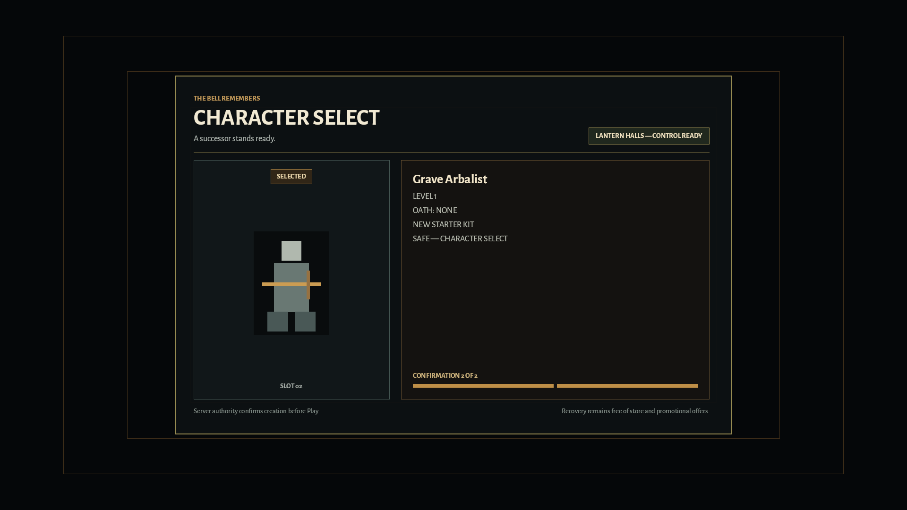

# GB-M03-07 native successor recovery visual evidence

**Result:** Pass. The optimized native recovery path preserves durable-death authority, presents the exact level-1 successor preset, requires two explicit confirmations, and withholds Hall control until both the accepted transfer and matching scene readiness are visible across the required resolution/effects matrix.

## Authority and capture identity

- Product authority: `Gravebound_Production_GDD_v1_Canonical.md` (`DTH-020`, `DTH-021`, `UI-009`, `QA-101`).
- Content authority: `Gravebound_Content_Production_Spec_v1.md` (`CONT-CATALOG-003`, the exact Grave Arbalist starter kit, and Core Hall authority).
- Delivery authority: `Gravebound_Development_Roadmap_v1.md` (`GB-M03-07` and the M03 death-to-successor recovery gates).
- Source revision: `8ffc9e93b6277bc52f641f1fb03ad1ac1e1183ab`.
- Coordinator revision: `3649032645aed87e69a1cd404dfe35679d0de541`.
- Optimized executable SHA-256: `3dfa3beda928f960f47c1cfd5780662e0495e55472902bb443cca752c9c5f920`.
- Optimized executable size: `73,482,240` bytes.
- Protocol/build identity: `1.17`, `m03-core-dev-identity-1`, negotiated disposable `core_successor_v1` authority.
- Successor target records BLAKE3: `722b7e16147dd4ba95082e93727b940383d4199b9d013424f68fbc00a354ddb8`.
- Successor localization BLAKE3: `ecdfe0c4819d0c67c219e9365c666a6c59215abe274856d8927600288b1a35eb`.
- Core item content revision: `core-dev.blake3.27818db710b7553520a162f6f8337dcd0419c459d20c6513a7e12c78fed24ebb`.
- Capture date: 2026-07-17 (`America/Los_Angeles`).
- Capture host: Windows 10 Home 10.0.19045; Intel Core i7-10700K; AMD Radeon RX 6700 XT, driver 32.0.21043.19003; 63.9 GiB visible RAM.
- Capture method: independent optimized launches of `target/release/client_bevy.exe core-successor-recovery-showcase`, using the real death/recovery/transition models, compiled content, native widgets, and 90 presentation-settle frames before atomic publication.
- Per-file integrity: [`GB-M03-07-successor-visual.sha256`](GB-M03-07-successor-visual.sha256) records every PNG SHA-256.

## Matrix

The primary 28-frame matrix captures all seven states in standard and reduced-effects modes at 1280×720 and 1920×1080. Four additional Character Select frames prove the supported 150% UI scale at both resolutions and effects modes. Programmatic decode verified exactly 32 PNGs, 16 at each resolution, no temporary files, a minimum encoded size of 48,605 bytes, and nonblank sampled color diversity.

| State | Required proof |
|---|---|
| `death-summary` | The durable summary retains loss/preservation/Echo truth and initially focuses the largest enabled `Create Successor` action; 1280×720 uses the real focus-reveal scrollbar. |
| `creating` | Confirmation one is pending, input is locked, and no successor identity is fabricated before the stored result. |
| `recoverable-create` | Response loss preserves the exact request and offers only the safe retry. |
| `character-select` | The exact Grave Arbalist/base silhouette, former slot 2, level 1, no Oath, new starter kit, and confirmation 1 of 2 are visible with `Play` as the sole route action. |
| `entering-hall` | Confirmation 2 of 2 is complete while the authoritative transfer remains pending; control is unavailable. |
| `loading-hall` | The accepted Hall snapshot still waits for matching compiled-scene readiness; control remains unavailable. |
| `hall-ready` | Only the matching Hall transfer plus scene readiness produces `LANTERN HALLS — CONTROL READY`. |

Original-resolution inspection passed title/safe-margin retention, copy wrapping, exact class/level/Oath/slot projection, primary-action focus, disabled/pending hierarchy, visible high-scale scrolling, and standard/reduced information parity. The 1280×720 death frame intentionally scrolls to the focused primary action while preserving a visible scrollbar; the 150% Character Select frame keeps `Play` visible and exposes bounded scroll rather than shrinking text below the certified scale.

## Representative frames

| Durable primary action at minimum size | Preselected successor at reference size |
|---|---|
|  |  |

Authoritative Hall readiness remains a separate terminal presentation state:

## Scope boundary

These captures prove the native projection, focus/input presentation, and coordinator composition. The disposable coordinator replaces only transport timing with checked delayed fixtures after the independent PostgreSQL/real-QUIC path passed in hosted run `29595244036`. Normal Character Select Play, production Hall/Realm admission, commerce, Core promotion, and all M04+ features remain disabled. The 25-journey timing/residue evidence is a separate remaining `GB-M03-07` gate.
