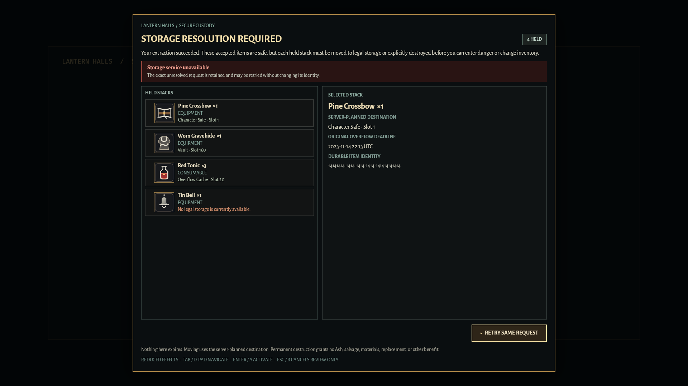

# GB-M03-08 native Resolution Hold visual evidence

**Result:** Pass. The optimized native Resolution Hold surface keeps the complete blocking shell, legal-storage authority, exact item identity, permanent-destruction warning, non-color focus, and safe retry/final-refresh states visible across the required 24-frame matrix.

## Authority and capture identity

- Product authority: `Gravebound_Production_GDD_v1_Canonical.md` (`LOOT-033`, `LOOT-050`, `LOOT-060`, `TECH-015`, and `UI-002`/`003`).
- Content authority: `Gravebound_Content_Production_Spec_v1.md` (`CONT-HUB-001`/`002`, exact Core item identities, and the Hall/Vault boundary).
- Delivery authority: `Gravebound_Development_Roadmap_v1.md` (`GB-M03-08`, private-loop terminal recovery, accessibility, and evidence gates).
- Source revision: `476c3aeb4572baa13830717ae0880bf174c140f4`.
- Layout hardening revision: `8e88ae294423417d8fbfd66c2b5959a5c0c2271a`.
- Optimized executable SHA-256: `f816771475e7da47c6da413d33e9da9299787fee9704fe7e73816f0e5afc1152`.
- Protocol/build identity: `1.16`, `m03-core-dev-identity-1`, negotiated `core_resolution_hold_v1`.
- Core item content revision: `core-dev.blake3.27818db710b7553520a162f6f8337dcd0419c459d20c6513a7e12c78fed24ebb`.
- Capture date: 2026-07-16 (`America/Los_Angeles`).
- Capture host: Windows 10 Home 10.0.19045; Intel Core i7-10700K; AMD Radeon RX 6700 XT, driver 32.0.21043.19003; 64 GiB installed RAM.
- Capture method: independent launches of `target/release/client_bevy.exe core-resolution-hold-showcase`, using the production client model, compiled Core catalog, reusable blocking plugin, and 90 presentation-settle frames before atomic publication.
- Per-file integrity: [`GB-M03-08-hold-visual.sha256`](GB-M03-08-hold-visual.sha256) records every PNG SHA-256. Programmatic validation confirmed exactly 24 files and exact encoded dimensions.

## Matrix

Each state has standard-effects and reduced-effects captures at both 1280×720 and 1920×1080. Files use the closed name `GB-M03-08-hold-<state>-<mode>-<resolution>.png` under [`GB-M03-08-hold/`](GB-M03-08-hold/).

| State | Required proof |
|---|---|
| `mixed-destinations` | CharacterSafe slot 1, Vault slot 160, Overflow slot 20, and unavailable-storage states remain server-authored and distinguishable. |
| `storage-full` | Move is disabled without a legal preview, permanent destruction remains separately available, and selected-row focus is non-color. |
| `confirm-destroy` | Whole-stack quantity, irreversible/reward-free warning, and `CANCEL — KEEP ITEM` default focus are explicit. |
| `mutation-pending` | Durable acknowledgement is pending, controls are locked, and no speculative outcome or exit action is shown. |
| `final-clear` | Stored acknowledgement leads to an authoritative refresh; control is not released from the mutation response alone. |
| `recoverable-error` | The exact unresolved request is retained and only `RETRY SAME REQUEST` is offered. |

Original-resolution inspection passed title/safety/footer retention, copy wrapping, item-icon and item-name authority, exact quantities and durable IDs, one-based destination labels, warning hierarchy, visible focus, disabled-action contrast, and standard/reduced information parity. No frame clips the blocking shell or exposes a route-to-play action.

Five additional identical mixed-destination launches produced the same SHA-256. A fresh independent decode of all 24 PNGs into one diagnostic contact sheet also reproduced the complete matrix; this guarded review against stale preview-cache output without changing the committed evidence bytes.

## Representative frames

| Full storage at the minimum viewport | Destructive review at the reference viewport |
|---|---|
|  |  |

Reduced effects preserves the same retry authority and exact request identity:

## Scope boundary

These captures prove native presentation and the client-side model/projection contract. They do not enable normal Character Select, Hall departure, Realm Gate admission, production terminal mutation, Core promotion, or any M04+ feature. PostgreSQL/real-QUIC same-tick precedence and shutdown/residue evidence remain separate `GB-M03-08` gates.
