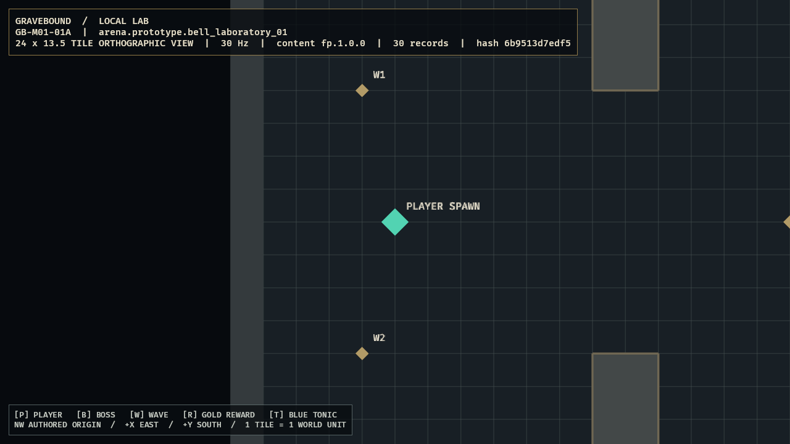

# GB-M01-01A completion audit

- **Status:** Passed
- **Audited:** 2026-07-10
- **Authorities reviewed together:** GDD `SIM-001` through `SIM-005` and Section 29; content specification `CONT-010`, `CONT-012`, and `CONT-FP-002`; roadmap M01 day-one target and implementation order 9
- **Feature registry:** `GB-M01-01A`, depending on `GB-M00-07`
- **Implementation commits:** `d091ad3`, `9974a3c`, `757cd8b`
- **CI hardening commits:** `cb457a0`, `d452a47`
- **Next feature:** `GB-M01-01B`

## Acceptance evidence

| Criterion | Evidence | Result |
|---|---|---|
| Exact authoritative geometry | `sim_core::ArenaGeometry` owns fixed-point bounds, shell, spawns, pillars, and named anchors. `sim_content` compiles `arena.prototype.bell_laboratory_01` and compares every field to the `CONT-FP-002` contract. | Passed |
| One tile equals one simulation/render unit | Client conversion uses milli-tiles only at the validated boundary, maps northwest coordinates with `x - width/2` and `height/2 - y`, and never consumes source/display pixels. Unit tests prove corners, spawn points, pillar centers, and sizes. | Passed |
| Stable orthographic view | `ScalingMode::FixedVertical { viewport_height: 13.5 }` preserves aspect ratio and yields exactly `24` visible tiles at 16:9. The camera is centered on the future local-player spawn. | Passed |
| Complete debug presentation | Runtime creates the `32 × 24` floor, four shell rectangles, four solid pillars, player/boss spawns, thirteen named anchors, a one-unit grid, diagnostic HUD, and shape-plus-label legend from the render plan. | Passed |
| Fail-closed startup | Client validates the full package before creating a Bevy window. Missing content, incorrect exact geometry, invalid bounds, duplicate/empty anchors, out-of-bounds points, overflow, and overlapping pillars return errors. | Passed |

## Verification

- `tools\dev.cmd ci`: passed.
- Workspace results: 21 tests passed, 0 failed.
  - `client_bevy`: 3 coordinate/render-plan/camera tests.
  - `content_schema`: 3 strict ID/schema tests.
  - `sim_content`: 6 package/reference/exact-arena tests.
  - `sim_core`: 9 geometry/determinism tests.
- Format and full pedantic Clippy: passed with warnings denied.
- Strict `fp.1.0.0` validation: passed, 30 records.
- M00 golden trace: passed twice in separate processes.
- Local optimized Windows build: passed in 8 minutes 26 seconds.
- Release runtime: remained running and responsive; produced the same frame bytes as debug evidence.
- Release/debug evidence SHA-256: `FA08FAC6B090341C1E84A81D30717E613D2A0A44FDF56AEA68F2DF09B4009899`.
- [Extended-budget control CI run 29132691534](https://github.com/MikeyPar/Gravebound/actions/runs/29132691534): success.
- [Final lld CI run 29133041817](https://github.com/MikeyPar/Gravebound/actions/runs/29133041817): success, including clean Windows release.

## Visual review

The first in-engine review found unsupported decorative glyphs; they were replaced with readable ASCII labels. A proposed exterior backdrop was rejected after screenshot evidence showed transparent-2D ordering interference. The accepted frame retains the authored boundary and intentional off-arena void while keeping the floor, grid, shell, pillars, and markers readable. Windows desktop capture did not support this Bevy surface (`0x80004002`), so the client now exposes `GRAVEBOUND_SCREENSHOT_PATH` and captures through Bevy's renderer after ten frames.

## Changed ownership boundaries

- `sim_core::arena`: authoritative geometry and invariant errors; no Bevy dependency.
- `sim_content`: strict content-to-simulation compilation and exact First Playable contract.
- `client_bevy::arena_view`: presentation-only coordinate conversion, render plan, sprites, grid, labels, camera, and screenshot hook.
- No gameplay coordinate is duplicated in client constants; presentation constants contain only camera extent, colors, line thickness, labels, and z-order.

## Deferred scope and conflicts

- Rebindable input, authoritative movement, collision response, player entity, and 80 ms camera follow smoothing belong to `GB-M01-01B`.
- Zoom controls, camera shake, combat, enemies, and production art remain later M01 scope.
- No conflict was found among the three design documents. The visible off-arena margin follows `SIM-002` player centering at the authored `(4,12)` spawn rather than silently clamping the camera.
