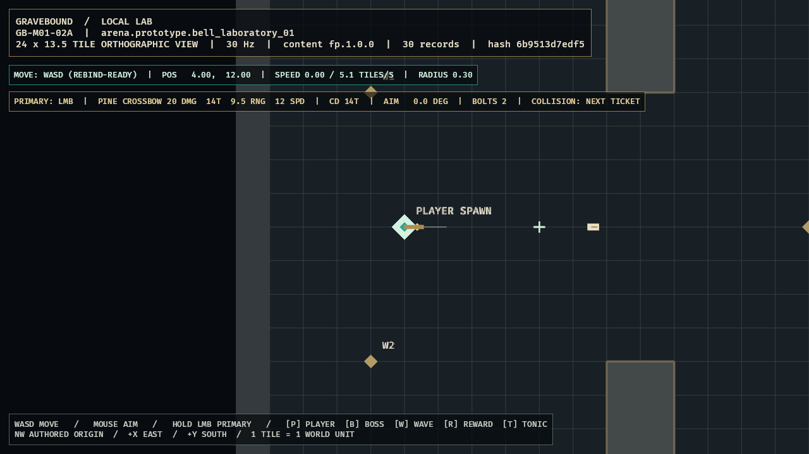

# GB-M01-02A completion audit

- **Status:** Passed
- **Audited:** 2026-07-10
- **Authorities reviewed together:** GDD `SIM-003`, `SIM-004`, `SIM-010`, `SIM-011`, `COM-001`, `CLS-020`, `TECH-004`, `TECH-011`, and Section 29; content specification `CONT-010`, `CONT-011`, `CONT-013`, `CONT-FP-001`, `CONT-FP-006`, and `CONT-ITEM-002`; roadmap M01 day-two target, work package `GB-M01-02`, and implementation order 11
- **Feature registry:** `GB-M01-02A`, depending on `GB-M01-01B`
- **Contract/decision commit:** `0645f40`
- **Content commit:** `f442a73`
- **Simulation commit:** `cd7d24f`
- **Client commit:** `06f121b`
- **Evidence hardening commits:** `75f6f1f`, `8962e0e`
- **Decision:** `ADR-003`
- **Next feature:** `GB-M01-02B`

## Acceptance evidence

| Criterion | Evidence | Result |
|---|---|---|
| Exact compiled Pine Crossbow | `sim_content::first_playable_weapon` resolves `class.grave_arbalist` → `ability.arbalist.primary_crossbow` and `item.prototype.weapon.pine_crossbow`. Required effects must be unique nonnegative `set` operations; range/radius/rate must agree with the primary grammar. The immutable result is damage 20, interval 14 ticks, range 9500 milli-tiles, speed 12000 milli-tiles/s, radius 100 milli-tiles, count 1, pierce 0, stop-first true, and lifetime 24 ticks. | Passed |
| Rebind-ready independent input | `PrimaryFireBindings` owns the left-mouse default. Camera viewport coordinates convert into render world and then northwest simulation coordinates. Aim normalizes independently of movement; coincident/no cursor retains the last valid direction. Each effective press increments once, short press/release between fixed ticks survives through its sequence, overflow fails, and blocked input remains suppressed until physical release. | Passed |
| Exact held cadence and sequence behavior | `PlayerCombatState` fires on the first held tick and then on ticks `T+14n`; the golden fixture proves ticks 1, 15, and 29. Release never resets the timer. Stale/reused sequences return typed errors without partially advancing tick, cooldown, IDs, or projectiles. | Passed |
| Stable projectile lifecycle | Every bolt receives a monotonic simulation `EntityId`, locks origin/aim, advances 0.4 tiles per travel tick, reaches 9.2 after 23 steps, clamps its 24th step to exactly 9.5, emits one expiry, and is removed. A checked exact-bit snapshot fixes IDs/positions/distances. Player movement after release cannot curve or relocate the bolt. | Passed |
| Presentation-only client | Fixed schedule sets enforce movement before combat. The client mirrors shot/expiry events into crossbow rotation, aim guide, reticle, bone-white bolts, muzzle/range effects, and diagnostics. Camera/input/presentation functions cannot write authoritative combat or movement state. | Passed |
| Scope boundary | No projectile collision, enemy hit, pierce consumption, or damage mutation exists in 02A. The HUD explicitly labels collision as the next ticket. | Passed |

## Verification

- `tools\dev.cmd ci`: passed on final code.
- Workspace results: 58 tests passed, 0 failed.
  - `client_bevy`: 17 render/input/gating/aim/camera/evidence tests.
  - `content_schema`: 3 strict ID/schema tests.
  - `sim_content`: 10 package/reference/exact-arena/exact-weapon tests.
  - `sim_core`: 28 clock/weapon/combat/movement/determinism tests.
- Format and full pedantic Clippy: passed with warnings denied.
- Strict `fp.1.0.0` validation: passed, 30 records.
- Generated schemas: current with no diff.
- Existing M00 golden trace: passed twice in separate processes with identical selected-tick hashes.
- New combat golden: exact shot ticks `[1,15,29]` and exact active-projectile ID/position/distance bit tuples passed.
- Optimized Windows build: passed in 2m29s.
- Optimized runtime: remained responsive; screenshot-only east-fire scenario atomically published a complete frame with no leftover partial file.
- Committed evidence SHA-256: `EB3D8544CD0C71CCDA38E96CE312396EA83FC84121EA028B832872C8D3907E04`.
- GitHub clean CI: recorded after the final audit push.

## Visual review

The accepted frame visibly proves a separate brass crossbow, eastward aim guide, shape-based reticle, fresh muzzle flash, two owner-friendly bone-white bolts at different travel ages, exact Pine Crossbow HUD values, active cooldown, stable player-centered view, and an unobstructed center aiming corridor. Friendly bolts do not use hostile red. The HUD explicitly says `COLLISION: NEXT TICKET`, preventing prototype presentation from implying unimplemented behavior.

The first optimized capture audit exposed incomplete PNG reads when the harness closed the process immediately. Capture now waits 60 frames, writes a same-directory partial image, flushes it, and atomically renames it. Immediate-close debug/release checks leave no partial file; subsequent visual inspection and SHA-256 verification read the complete frame.

## Adversarial audit

- Missing, duplicate, negative, or wrong-operation required item effects fail compilation.
- Consistently changing item and ability values still fails the exact `CONT-FP-006` fixture.
- Zero/non-finite aim and non-finite player origins fail closed.
- One press sampled across many render frames increments once; a short press remains observable after release.
- A press begun while combat is blocked cannot leak into gameplay when the gate opens.
- Reused/regressed sequences and projectile-ID exhaustion are transactional failures.
- Projectile updates use ascending stable IDs, locked aim/origin, exact range clamp, and no random or unordered selection.
- The 30 Hz fixed schedule, not render delta, owns cooldown and travel.
- Unknown screenshot scenario names, scenario use without a requested screenshot, and existing atomic destinations fail rather than silently changing runtime behavior.

## Deferred scope and conflicts

- `GB-M01-02B` owns swept solid/enemy-hurtbox collision, first-contact ordering, termination events, and collision debug shapes.
- `GB-M01-05A` owns health, damage order, armor/resistance, and damage events; 02B must not pull those mutations forward.
- Right-stick aim, aim assist, persistent bindings, audio, production sprites, and equipment switching remain later work.
- No unresolved conflict was found among the three design documents. ADR-003 explicitly resolves the previously unspecified first-shot, zero-length aim, timer, spawn/update, and final-range ordering.
