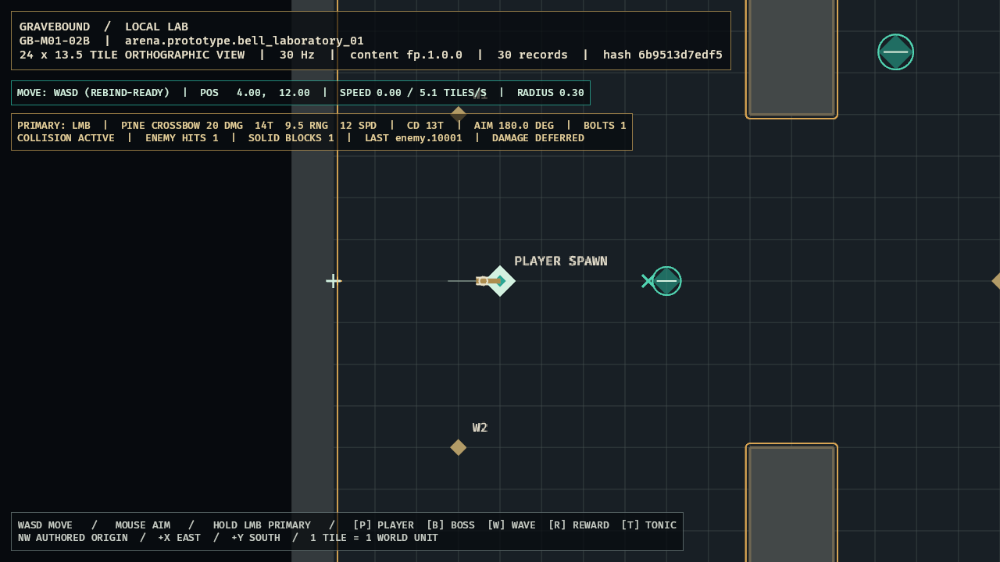

# GB-M01-02B completion audit

- **Status:** Passed
- **Audited:** 2026-07-10
- **Authorities reviewed together:** GDD `SIM-001`, `SIM-010`, `SIM-011`, `COM-001`, `COM-009`, `CLS-020`, and Section 29; content specification `CONT-FP-001`, `CONT-FP-002`, `CONT-FP-006`, and `CONT-FP-009`; roadmap M01 day-two target, work package `GB-M01-02`, and implementation order 12
- **Feature registry:** `GB-M01-02B`, depending on `GB-M01-02A`
- **Contract/decision commit:** `f2d36f9`
- **Simulation commit:** `04407cc`
- **Client commit:** `15f4b93`
- **Determinism/event-order commits:** `6071580`, `c95bccd`
- **Evidence hardening commit:** `3606b43`
- **Decision:** `ADR-004`
- **Next feature:** `GB-M01-02C`

## Acceptance evidence

| Criterion | Evidence | Result |
|---|---|---|
| No tunneling against exact geometry | `sim_core::collision` performs a closed continuous sweep over each clamped `0.4`-tile candidate segment. Shell bounds are inset by the `0.10` projectile radius; pillars use exact face slabs plus rounded Minkowski corners; enemies use combined-radius segment/circle quadratics. Tests cover face contact, rounded-corner near miss/hit, tangent, initial overlap, and a two-tile high-speed enemy sweep. | Passed |
| Deterministic earliest contact and terminal state | Candidates compare by `f32::total_cmp`, then solid-before-enemy and stable target ID. Canonical pillar indices come from sorted compiled geometry. The golden runs twice and pins ticks, projectile/target IDs, event order, terminal-position bits, and distance bits. A dedicated same-tick fixture proves projectile IDs `1,2` emit in order even when enemy input is reversed. | Passed |
| One zero-pierce terminal event without damage | Collision precedes range terminalization on the clamped segment. A contact moves the projectile center only to the realized fraction, accumulates only realized distance, emits one `ProjectileCollision`, and removes the bolt. Contact cannot also expire. No health, armor, status, death, reward, inventory, or persistence type is present in the collision path. | Passed |
| Simulation-owned target and readable presentation | `ProjectileCollisionWorld` validates and owns stable enemy circles and arena solids. Bevy consumes the same immutable snapshot, renders live circular hurtboxes/projectile outlines and expanded solid outlines, mirrors typed collision events, and never decides a hit from sprites. Enemy X and solid + effects, counters, last stable target, and `DAMAGE DEFERRED` state are visible. | Passed |
| Quality and release gates | Full local CI, strict content validation, duplicate deterministic replay, warnings-as-errors Clippy, optimized Windows build, warning-free runtime, complete atomic PNG, and GitHub Actions pass. | Passed |

## Verification

- `tools\dev.cmd ci`: passed on final code.
- Workspace results: 67 tests passed, 0 failed.
  - `client_bevy`: 17 render/input/gating/aim/camera/evidence tests.
  - `content_schema`: 3 strict ID/schema tests.
  - `sim_content`: 10 package/reference/exact-arena/exact-weapon tests.
  - `sim_core`: 37 clock/weapon/collision/combat/movement/determinism tests.
- Format and full pedantic Clippy: passed with warnings denied.
- Strict `fp.1.0.0` validation: passed, 30 records.
- Existing M00 golden trace: passed twice in separate processes with identical selected-tick hashes.
- Collision golden: exact terminal ticks `[2,16]`, projectile IDs `[1,2]`, stable enemy/pillar targets, and six terminal float-bit fields passed twice.
- Same-tick collision fixture: two active bolts emitted IDs `[1,2]` on tick 16 regardless of reversed enemy input.
- Optimized Windows build: passed in 2m18s on the final client code.
- Optimized runtime: semantic capture waited for both authoritative contact counters and then 60 settled render frames; runtime emitted zero warnings.
- Committed evidence SHA-256: `5CE5AC318FEE4DDB6529C2294687C1140315BCCB8DB7E96394C2C523F9C2B289`.
- GitHub clean CI: recorded after the final audit push.

## Visual review

The accepted optimized frame visibly proves the inset shell collision boundary, rounded expanded pillar outlines, three circular nondamageable enemy hurtboxes, a solid-contact `+`, an enemy-contact `X`, and HUD counters reading one enemy hit and one solid block. The last target is the stable ID `enemy.10001`; `DAMAGE DEFERRED` makes the roadmap boundary explicit. Shape and luminance distinguish every state without relying on color alone, and hostile-projectile red remains unused.

The initial evidence attempt exposed two real presentation-quality issues: Bevy hierarchy warnings on transform-only parents and an incomplete GPU composite when screenshot capture was requested on the same frame as a contact. Parents now carry explicit visibility, the collision scenario captures only after both simulation counters are positive, and the renderer settles for 60 additional frames before the atomic write. The accepted optimized run produced no warnings and a complete frame.

## Adversarial audit

- Projectile motion is swept continuously, so the 12-tiles/second bolt cannot skip a `0.10`-tile or larger contact between tick endpoints.
- Pillar collision uses rounded corners rather than a false-positive expanded AABB.
- Closed tangency and initial overlap terminate at the first legal fraction, including fraction zero.
- Range is clamped before the sweep; collision at the range endpoint wins over expiry and cannot double-terminate.
- Numerically earlier contact wins; exact fraction ties resolve solid before enemy, then semantic solid ID or stable entity ID.
- Enemy input is canonicalized by entity ID; duplicates, non-finite/zero radii, non-finite centers, and solid-overlapping hurtboxes fail construction.
- Non-finite sweep inputs, oversized projectile circles, and calculated non-finite contacts fail the cloned combat step transactionally.
- Projectile vectors remain stable-ID ordered; same-tick events retain that order.
- Missing presentation entities cannot alter authoritative collision state.
- Debug targets are immutable, nondamageable, local-only, and create no rewards, status, death, or persistence.

## Deferred scope and conflicts

- `GB-M01-05A` exclusively owns `COM-002` health, armor, resistance, damage bands, damage events, and death ordering. `GB-M01-02B` emits contact facts only.
- `GB-M01-02C` owns Grave Mark; `GB-M01-02D` owns Slipstep's one-pierce empowered shot. General pierce continuation and per-target ignore sets remain deferred until those contracts require them.
- Moving-target continuous collision requires an authored tick-relative trajectory contract; this ticket deliberately consumes an immutable tick hurtbox snapshot.
- The three documents do not specify Grave Mark projectile radius or solid-impact disposition. That is a `GB-M01-02C` specification gap, not an unresolved conflict inside completed `GB-M01-02B`.
