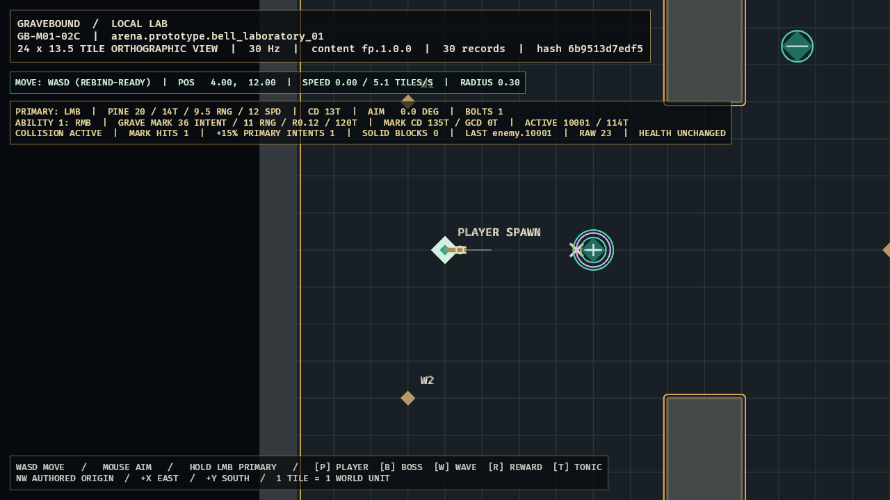

# GB-M01-02C completion audit

- **Status:** Passed locally; GitHub explicitly excluded from this gate by user direction
- **Audited:** 2026-07-10
- **Authorities reviewed together:** GDD `SIM-003`, `SIM-004`, `SIM-010`, `CLS-002`, `CLS-020`, and Section 29; content specification `CONT-010`, `CONT-011`, `CONT-013`, `CONT-FP-001`, and the exact FP ability record; roadmap M01 day-three target, work package `GB-M01-02`, and implementation order 13
- **Feature registry:** `GB-M01-02C`, depending on `GB-M01-02B`
- **Decision:** `ADR-005`
- **Next feature:** `GB-M01-02D`

## Acceptance evidence

| Criterion | Evidence | Result |
|---|---|---|
| Exact compiled definition | `sim_content::first_playable_grave_mark` requires one class reference and the exact authored 5,000/12,000/11,000/18,000/4,000/1,500/1 record. It resolves `CONT-013` radius 120 milli-tiles, consume-on-solid, 150/5/3/120 timing ticks, and 28 travel ticks into immutable `sim_core::GraveMarkDefinition`. Even a +1 ms authored mutation fails exact validation. | Passed |
| Sequenced input and timing | Client right mouse increments once per physical press, is replaceable, suppresses blocked presses until release, and fails on overflow. Simulation validates monotonic ability sequences transactionally, fires ready input immediately, consumes readiness 4 as too early, buffers/replaces at exact readiness 3/2/1, and fires the newest sequence at zero. Cooldown and GCD begin on fire. | Passed |
| Collision, mark, and intent behavior | Grave Mark shares the authoritative swept collision world. Enemy contact emits base/multiplier/resolved intent `20/18,000/36` and applies one 120-tick owner mark. A later-ID same-tick primary reads that mark and emits `20/11,500/23`. Same-target contact refreshes; different-target contact replaces; solid contact consumes without mark/intent; range expiry is inert. No health type is mutated. | Passed |
| Deterministic state and boundaries | The golden runs twice and pins source/projectile IDs, collision position/distance bits, intent multipliers/values, cooldowns, target ID, remaining ticks, and active-through-121/expire-on-122 boundary. Projectiles process in ascending ID order; no unordered iteration controls outcomes. | Passed |
| Playable presentation and quality gates | LocalLab visibly renders the distinct Mark bolt/impact, dual target ring, active target/timer, cooldown/GCD, Mark hit, `+15%` primary intent, raw 23, and `HEALTH UNCHANGED`. Full local CI, optimized build, warning-free runtime, semantic capture, and direct visual inspection pass. | Passed |

## Verification

- `tools\dev.cmd ci`: passed on final implementation.
- Workspace results: 80 tests passed, 0 failed.
  - `client_bevy`: 19 render/input/gating/aim/camera/evidence tests.
  - `content_schema`: 3 strict ID/schema tests.
  - `sim_content`: 12 package/reference/exact-arena/exact-weapon/exact-ability tests.
  - `sim_core`: 46 ability/clock/weapon/collision/combat/movement/determinism tests.
- Format and full pedantic Clippy: passed with warnings denied.
- Strict `fp.1.0.0` validation: passed, 30 records.
- Existing M00 golden trace: passed twice in separate processes with identical selected-tick hashes.
- Grave Mark golden: repeated exact event/state snapshot passed, including float-bit terminal coordinates and lifetime boundary.
- Optimized Windows build: passed in 2m53s.
- Optimized runtime: warning-free; semantic capture waited for a Mark hit plus marked-primary intent and 60 settled presentation frames.
- Accepted evidence SHA-256: `FDD1504AE153A68CAD4839E3CBA113DB545B23EE10407B8AD282F87877DBAEC0`.
- GitHub Actions: intentionally not required or evaluated for this local completion gate.

## Visual review

The accepted frame shows the nearest debug enemy inside a two-ring lavender/teal owner mark, distinct collision glyphs, and a readable three-line HUD. It proves one Mark hit, one `+15%` primary intent, stable target `enemy.10001`, raw intent `23`, active remaining ticks, ability cooldown, zero GCD, and `HEALTH UNCHANGED`. Shape, nested rings, and luminance preserve meaning without color alone; hostile red remains reserved.

The release screenshot pipeline intermittently returned an incomplete GPU composite on its first attempt even after semantic readiness. The artifact was rejected. Re-running the already-built optimized binary produced a complete frame byte-identical to the accepted debug capture and zero warnings; only that inspected file is committed.

## Adversarial audit

- `CONT-013` radius 0.12 is resolved centrally; the Pine Crossbow's item-specific 0.10 cannot leak into Grave Mark.
- Authored millisecond values are checked before tick rounding, so +1 ms cannot hide inside the same rounded tick count.
- Right-mouse press sampling increments once, preserves short presses, suppresses captured-menu input, and fails rather than wrapping.
- Simulation sequence regression, projectile-ID exhaustion, invalid aim/player state, and intent overflow are transactional failures.
- Readiness 4 is consumed; readiness 3, 2, and 1 buffer and replace with the newest legal press.
- The bolt advances 27 full 0.4-tile steps to 10.8, then clamps the 28th step to exactly 11.0.
- Enemy/solid/range terminals are mutually exclusive. Solid and range terminals cannot alter the active mark or emit raw damage.
- Apply, refresh, replace, last-active tick, and expiry are all explicitly tested.
- Mark-before-primary same-tick behavior depends only on ascending projectile ID and cannot apply retroactively.
- Debug enemies remain nondamageable; no health, death, reward, inventory, or persistence mutation was introduced.

## Deferred scope and conflicts

- `GB-M01-05A` owns `COM-002` mitigation, health, armor, barrier, damage events, and death. It will consume the stable raw-intent seam created here.
- `GB-M01-02D` owns Slipstep, Exhaustion, empowered-primary speed, and one-pierce traversal/ignore sets.
- Dented Scope, Mark Lens, Long Vigil, Nailkeeper, target-death cleanup, controller input, production assets/audio, networking, and persistence remain later work.
- No unresolved conflict remains among the three design documents for `GB-M01-02C`. `CONT-013` supplies radius 0.12, and Nailkeeper's authored wall-impact behavior establishes the base bolt's solid contact.
