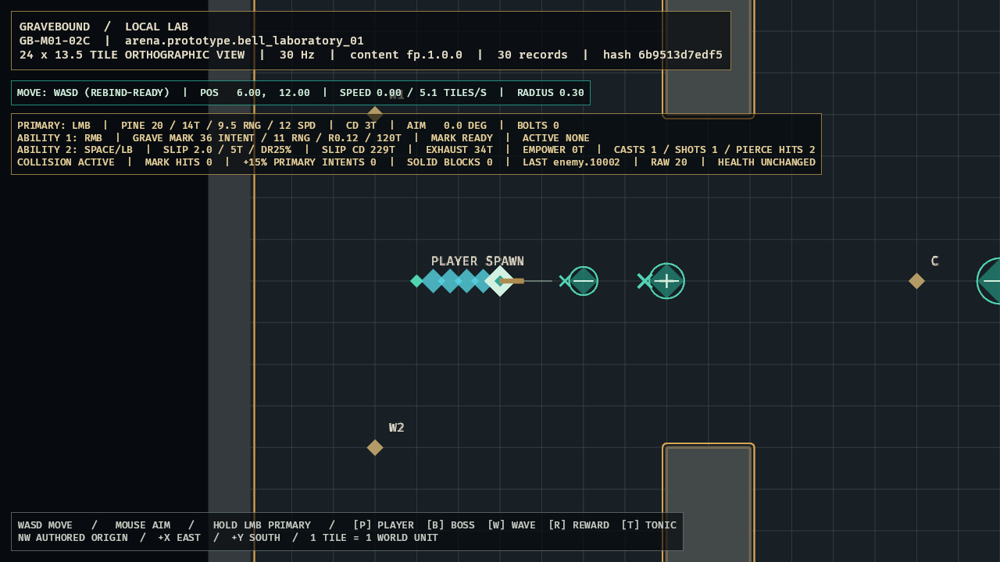

# GB-M01-02D completion audit

- **Status:** Passed locally; GitHub explicitly excluded by user direction
- **Audited:** 2026-07-10
- **Authorities reviewed together:** GDD `SIM-003`, `SIM-004`, `SIM-005`, `SIM-010`, `CLS-002`, `CLS-020`, `CLS-040`, and Section 29; content specification `CONT-010`, `CONT-011`, `CONT-FP-001`, `CONT-FP-002`, `CONT-FP-006`; roadmap M01 day-three target, `GB-M01-02`, and implementation order 14
- **Feature registry:** `GB-M01-02D`, depending on `GB-M01-02B`
- **Decision:** `ADR-006`
- **Next feature:** `GB-M01-02E`

## Acceptance evidence

| Criterion | Authoritative evidence | Result |
|---|---|---|
| Exact compiled definition | `sim_content::first_playable_slipstep` requires one class reference and the exact authored `8000/2000/180/2500/1500/3000/1/1500` tuple. It compiles immutable `240/5/3/5/45/45` tick values; even `+1 ms` drift fails strict validation. | Passed |
| Sequenced input/state | Client defaults to replaceable Space/left bumper, sequences once per physical press, suppresses blocked presses until release, and fails on overflow. Simulation handles readiness four as too early, three/two/one as replaceable buffer, GCD slot order, Exhaustion rejection, and stale-sequence rollback of both movement and combat. | Passed |
| Exact safe movement | Activation locks normalized movement or inverse aim, moves the first segment before primary, suppresses walking, and sweeps the 0.30-radius player through five segments. Final endpoint is bit-exact two tiles; shell/pillar contact clamps and terminates without sliding; enemy hurtboxes do not block. | Passed |
| Empowerment and pierce | Activation arms 45 ticks and exposes 2,500 basis-point reduction on travel ticks. Same-tick Pine primary consumes empowerment at origin after the first segment, uses exact 15.6 speed, contacts two stable distinct enemy IDs once each, and stops on the second enemy or a solid after the first. Contact identity includes monotonic ordinal. Expiry occurs before fire on the first ineligible tick. | Passed |
| Playable presentation/quality | LocalLab shows the exact `(4,12)->(6,12)` trail, two distinct contact glyphs, one cast/shot, two pierce hits, active cooldown/Exhaustion, and `HEALTH UNCHANGED`. Full local CI, optimized build, warning-free release runtime, semantic capture, and direct inspection pass. | Passed |

## Verification

- `tools\dev.cmd ci`: passed after the final exact-endpoint correction.
- Workspace: 90 tests passed, 0 failed: `client_bevy` 21, `content_schema` 3, `sim_content` 13, `sim_core` 53.
- Formatting and full all-target warnings-as-errors Clippy: passed.
- Strict `fp.1.0.0`: passed, 30 records. Schema regeneration completed without schema worktree changes.
- M00 deterministic trace: two separate runs emitted identical selected-tick BLAKE3 hashes.
- Slipstep fixtures pin exact endpoint bits, timers, state transitions, contact order/ordinals, continuation, and transactional movement/combat behavior.
- Optimized Windows build: passed in 2m30s.
- Optimized runtime: zero warning/error/panic log matches on the accepted run.
- Accepted evidence SHA-256: `02F7DD375A2FD14631DBD902EE77BE2D7B7F95B619545D22CA17C1F11A5FDD74`.
- GitHub Actions: intentionally not required or evaluated for this local gate.

## Visual review

The accepted optimized frame shows the player at exact `(6.00,12.00)` from spawn `(4.00,12.00)`, four visible cyan afterimages plus the terminal sample under the player, two shape-distinct target contacts, cooldown `229T`, Exhaustion `34T`, `CASTS 1`, `SHOTS 1`, `PIERCE HITS 2`, and unchanged health. The trail and impact crosses remain distinguishable by geometry and luminance without color alone.

The first debug runtime attempt exposed a Bevy mutable-query alias panic; disjoint query filters fixed it before acceptance. The first optimized capture then produced an incomplete black GPU composite despite semantic readiness and no logged warning; it was rejected. Re-running the already-built release binary produced the complete inspected frame above with zero warning/error/panic matches.

## Adversarial audit

- Authored milliseconds are checked before nearest-tick conversion, so value drift cannot hide inside the same tick count.
- Input sequences, projectile IDs, modifier arithmetic, contact ordinals, target ignores, aim, movement, and collision outputs fail closed; avatar mutation commits only after the whole step succeeds.
- Final movement uses the locked authored endpoint on the fifth segment. CI caught and eliminated a one-ULP accumulation drift rather than accepting tolerance-only evidence.
- Solid sweeps use environment geometry only; enemies cannot body block. Exact contact consumes remaining cast distance and clears velocity.
- Ability 1 owns a same-tick GCD tie. Slipstep then moves before primary origin capture; the shot consumes empowerment on emission.
- Empowerment and Exhaustion are active on 45 exact tick indices and expire before input/fire on the next boundary.
- Piercing traversal keeps sorted unique target IDs, applies stable solid-first/entity-ID collision order to every remaining subsegment, and cannot damage one target twice.
- Multiple same-tick contacts are uniquely correlated to raw intents by `(tick, projectile_id, contact_ordinal)`; presentation does not despawn a continuing projectile early.
- No health, armor, barrier, resistance, invulnerability, death, reward, inventory, or persistence mutation was added.

## Deferred scope and conflicts

- `GB-M01-05A` owns mitigation and health mutation; this milestone emits only the exact direct-reduction intent.
- `GB-M01-02E` owns Stillness/Focused, including Slipstep and future damage break transitions.
- Slip Clasp, oath changes, controller configuration UI, production audio/art, networking, persistence, and target lifecycle remain later work.
- No unresolved conflict remains among the three design documents for `GB-M01-02D`. `CONT-010` resolves 180 ms to five ticks; ADR-006 records all previously unstated deterministic edge rules.
