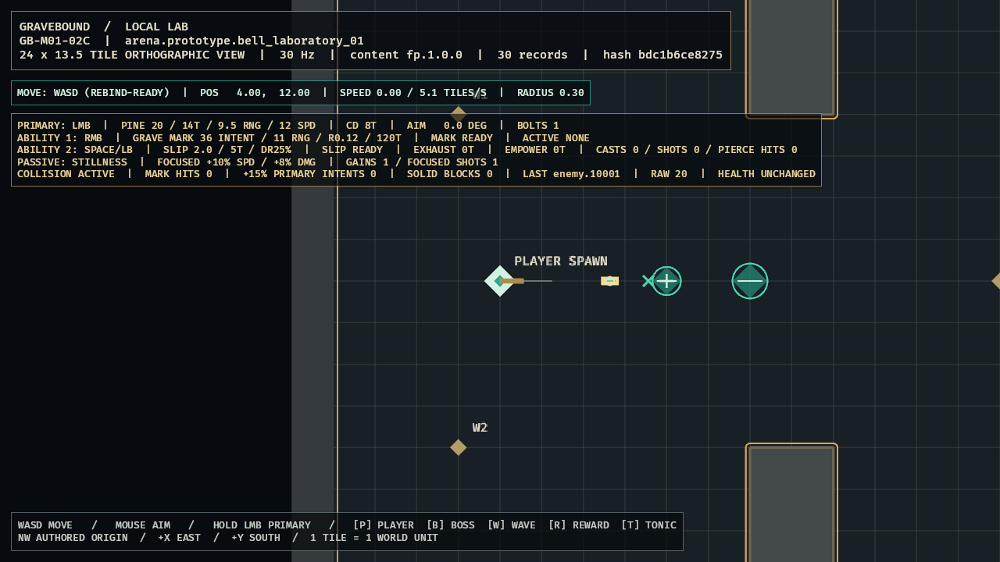

# GB-M01-02E completion audit

- **Status:** Passed locally; GitHub explicitly excluded by user direction
- **Audited:** 2026-07-10
- **Authorities reviewed together:** GDD `SIM-005`, `SIM-010`, `COM-002`, `CLS-020`, and Section 29; content specification `CONT-010`, `CONT-011`, `CONT-FP-001`, `CONT-FP-006`; roadmap M01 day-three target, `GB-M01-02`, and implementation order 15
- **Feature registry:** `GB-M01-02E`, depending on `GB-M01-01B`
- **Decision:** `ADR-007`
- **Next feature:** `GB-M01-11`

## Acceptance evidence

| Criterion | Authoritative evidence | Result |
|---|---|---|
| Exact compiled definition | `sim_content::first_playable_stillness` requires the class passive reference and exact authored `600/2000/1000/800/true/true` tuple, compiling immutable 18-tick activation and rejecting drift. | Passed |
| Threshold and tick order | `sim_core` evaluates strict-below-threshold post-movement velocity, counts consecutive eligible samples, gains on tick 18 before primary, and resets on equality/faster motion. | Passed |
| Immediate deterministic breaks | Movement and Slipstep break/reset before same-tick primary. The simulation-owned damage seam emits `BrokenByDamage` only for active Focused and is reserved for ordered `GB-M01-05A` integration. | Passed |
| Projectile and modifier math | Focused Pine primary captures raw damage `22`, speed `13.2`, and provenance. Same-tick earlier Grave Mark composes the marked collision as `22 -> 25` through sequential half-up stages. | Passed |
| Playable presentation/quality | LocalLab shows Focused state, a shape-distinct Focused bolt, gain/shot counts, collision diagnostics, and the explicit unchanged-health boundary in the optimized semantic capture. | Passed |

## Verification

- `tools\dev.cmd ci`: passed.
- Workspace: 96 tests passed, 0 failed: `client_bevy` 21, `content_schema` 3, `sim_content` 14, `sim_core` 58.
- Formatting and full all-target warnings-as-errors Clippy: passed.
- Strict `fp.1.0.0`: passed, 30 records.
- M00 deterministic trace repeat: two separate runs emitted identical selected-tick hashes.
- Stillness fixtures passed for exact definition, strict threshold boundary, tick-18 gain-before-fire, movement/Slipstep/damage breaks, speed/raw math, and Grave Mark composition.
- Optimized Windows build: passed in 2m41s.
- Optimized runtime warning/error/panic scan: zero matches.
- Accepted evidence path: [`docs/evidence/GB-M01-02E.png`](../evidence/GB-M01-02E.png).
- Accepted evidence SHA-256: `F9C78FD6CBEBAE09F0035FB13D54FC3FC9CAA553FEBF3C8C5154368EC77ED3B7`.
- GitHub Actions: intentionally excluded by user direction.

## Visual review

The inspected optimized frame shows `FOCUSED +10% SPD / +8% DMG`, one gain, one Focused shot, the gold/teal core Focused bolt, stable collision feedback, and `HEALTH UNCHANGED`. Shape, luminance, text, and projectile treatment carry the state without relying on hue alone, while the persistent HUD remains above the aiming corridor.

## Adversarial audit

- Authored milliseconds are checked before nearest-tick conversion, so a value drift that still rounds to 18 ticks cannot pass.
- Threshold closure is strict: exact 20% is ineligible. The sample uses realized post-movement velocity and resolved final movement speed, not input intent.
- Focused cannot activate early: seventeen consecutive eligible samples remain in buildup, and the eighteenth gain precedes same-tick primary resolution.
- Faster movement and Slipstep break Focused before fire. Slipstep travel cannot accumulate Stillness.
- Damage break is a state-owner seam only. No health, hostile hit, mitigation, or death behavior is fabricated before `GB-M01-05A`.
- Focused emission captures immutable provenance, exact `13.2` speed, and sequentially rounded raw damage `22`. Marked collision consumes that base and resolves `25`; it does not recalculate from weapon damage.
- Slipstep speed empowerment takes precedence rather than stacking. A same-tick Slipstep begin has already removed Focused.
- Invalid definitions, nonfinite movement state, arithmetic overflow, and downstream avatar-step failures must fail closed without partial movement/combat mutation.
- Client visuals and HUD consume authoritative transitions/projectile state; they do not infer Focused from render-frame timing.

## Deferred scope and conflicts

- `GB-M01-05A` owns incoming damage validation, mitigation, health mutation, and invocation of the Focused damage-break seam inside the authoritative damage order.
- `item.prototype.charm.still_eye`, oaths, other equipment overrides, enemy damage, Red Tonic, death, networking, persistence, and production audiovisual assets remain later work.
- No unresolved conflict is known among the three design documents. ADR-007 records the previously unstated threshold closure, post-movement sample, same-tick precedence, speed precedence, and sequential rounding rules.
- No unresolved conflict remains for this ticket; all final gates above are proven locally.
