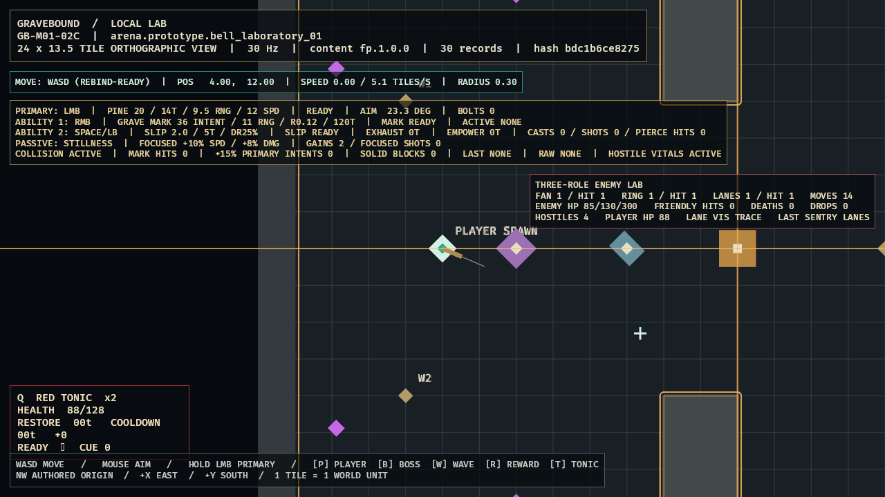

# GB-M01-03A completion audit

- **Status:** `PASS` (local gate; GitHub intentionally excluded)
- **Audited:** 2026-07-10
- **Authorities reviewed together:** GDD `SIM-010/011`, `COM-001/003/005/006/009`, `ENC-003/004`; Content `CONT-010/011/013`, `CONT-FP-003/004/008/009`; Roadmap M01 day four, work package `GB-M01-03`, ordering row 17
- **Content:** `enemy.drowned_pilgrim`, `pattern.enemy.drowned_pilgrim.fan`, `reward.prototype.normal_enemy`
- **Decision:** `ADR-010`
- **Next implementation dependency:** `GB-M01-04A`; the Bell Proctor content-version conflict remains separately escalated

## Evidence matrix

| Criterion | Current evidence | Result |
|---|---|---|
| Exact FP compilation | `sim_content::first_playable_drowned_pilgrim` requires unique manifest/enemy/pattern/reward references, exact state order and authored milliseconds, every attack field, and equality with the immutable sim-core definition. Same-rounded `899 ms` drift fails. | Passed |
| Deterministic simulation | Sim-core owns spawn/Acquire/Approach/Windup/Fire/Recover, inclusive aggro/stop/leash boundaries, locked aim, monotonic cast IDs, and typed overflow. | Passed |
| Fixed trace | BLAKE3 `46c5efb70afe8f9237c12e850e0d9eae4e60a264c45f680d182531073a354e39`; includes explicit `pierces_players=false`, and repeated replay equality passes. | Passed |
| Cumulative automated gate | `tools\dev.cmd ci` passed: 220 tests (`client_bevy` 27, `content_schema` 3, `sim_content` 23, `sim_core` 167), strict all-target Clippy, strict content validation, and two identical M00 traces. | Passed |
| LocalLab presentation | Optimized showcase proves spawn safety, `MOVES 14` approach samples, locked three-bolt fan, distinct Pilgrim silhouette, and labeled event/hit state. | Passed |
| Hostile collision/damage | ID-ordered swept fan contact resolves canonical Physical Chip damage into shared player vitals and breaks Focused transactionally. | Passed |
| Death/drop readability | Optimized death showcase proves exact armored health, dead-hurtbox removal, `DEATHS 1`, and one gold normal-reward seam at the death position after eight ticks. | Passed |
| Runtime evidence | Release build passed in 3m02s; both accepted captures emitted zero warning/error/panic matches and were inspected at 1280x720. | Passed |

## Adversarial evidence

- Wrong/duplicate/missing enemy, pattern, reward, or manifest reference fails closed.
- Wrong state order/duration, role/stat tuple, pattern kind/optional payload, damage type/band, threat, memory, counterplay, disposition, cue, or cap fails.
- Spawn/windup prevent early attack; zero aim retains the last valid direction; target loss/leash returns safely to Acquire.
- Simulation events remain renderer-independent and do not claim health, death, reward, or persistence ownership.

## Accepted runtime evidence

- Three-role combat: [`GB-M01-03A-03C.png`](../evidence/GB-M01-03A-03C.png), SHA-256 `5B87769E6379CE4BAFF9BFBCC3878A5CCFC7394AA9E76BDB9E8057B935F66408`.
- Enemy death/drop: [`GB-M01-03-death-drop.png`](../evidence/GB-M01-03-death-drop.png), SHA-256 `EE4400F1A7E4BC82EB485E1A2B7D3A2DEC85E4D542AF061EF1D770622AF42B0B`.
- Incomplete GPU composites were explicitly rejected before these frames were accepted.

Reward RNG/pickup/inventory resolution remains `GB-M01-07A/B`; player death cause and restart remain `GB-M01-06A/B`. Those downstream scopes do not reopen this completed attack, damage, enemy-death, and drop seam.
