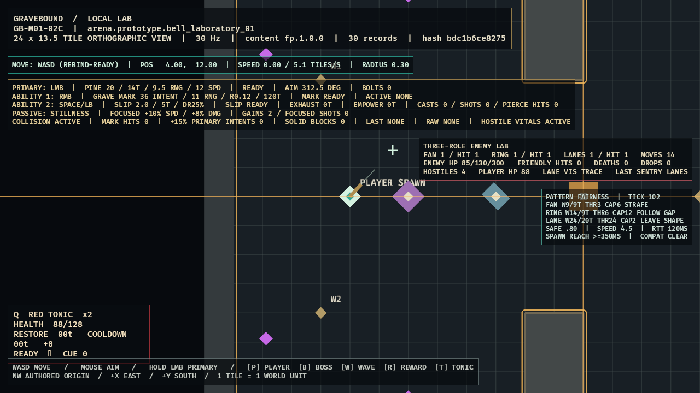

# GB-M01-04A completion audit

- **Status:** PASS (local gate; GitHub intentionally excluded)
- **Audited:** 2026-07-11
- **Authorities reviewed together:** GDD `ENC-003`, `ENC-004`, `COM-005`, `COM-006`, `SIM-010`, `SIM-011`, and Section 29; content specification `CONT-010` through `CONT-013`, `CONT-FP-004`, `CONT-FP-005`; roadmap M01 day-five/readability dependencies, `GB-M01-04`, and implementation order 20
- **Decision:** `ADR-011`
- **Current next work:** `GB-M01-04B/04C` now pass; continue the remaining M01 external evidence gates

## Acceptance evidence

| Criterion | Authoritative evidence | Result |
|---|---|---|
| Generalized immutable primitives | `sim_core::pattern` models fan, ring-with-gap, telegraphed lane, fixed timeline, common attack semantics, and lossless adapters for existing attack definitions. | Passed locally |
| Exact warning/cue/schema semantics | Stable ID derivation, Major+ audio, five damage-band minimums, ceiling ticks, raw/type/band/lifetime, grammar, phase cancellation, and sorted typed diagnostics are implemented. | Passed locally |
| Numeric fairness/combination boundaries | Exact baseline fields, corridor/clearance helpers, integer arrival, close-spawn, caps, threat, tag conflicts, and exact Frostbind-speed fixture semantics are implemented. | Passed locally |
| Actual safe-path proof | `solve_first_playable_min_speed_paths` proves typed Pilgrim strafe, Reed gap-follow, and Sentry leave-shape routes at exact 4.5 speed, radius .25, 120ms RTT, no ability, warnings, geometry, 0.80 corridor, 350ms arrival, threat, and caps. | Passed |
| Strict generalized content compilation | Strict enemy/pattern records compile into exact definitions; lossless adapters validate all shared fields and the three-pattern combination. Bell Proctor content is correctly deferred to 04B and its version decision. | Passed |
| Timeline/threat/cap presentation | Accepted LocalLab overlay reads validated definitions and shows current tick, W9/9, W14/9, W24/20, threat 3/6/24, caps 6/12/2, counterplay, corridor, speed, RTT, reach floor, and `COMPAT CLEAR`. | Passed |
| Optimized runtime evidence | Warning-free optimized capture was directly inspected; the compact right panel preserves the central aiming corridor and labels the evidence-only lane trace. | Passed |

## Verification completed

- `cargo test -p sim_core pattern::tests --locked`: 10/10 focused pattern tests passed.
- Pattern tests cover exact warning minima/ticks, adapters, corridor/arrival geometry, sorted adversarial diagnostics, fixed timeline semantics, forbidden/Frostbind combinations, and fast-spawn/Major-audio rejection.
- `rustfmt --edition 2024 --check crates/sim_core/src/pattern.rs`: passed.
- `git diff --check -- crates/sim_core/src/pattern.rs`: passed.
- Strict workspace all-target Clippy passed with warnings denied.
- Final cumulative repository gate: 223 tests (`client_bevy` 27, `content_schema` 3, `sim_content` 23, `sim_core` 170), strict content validation, and identical repeated foundation traces.
- Optimized Windows build passed in 2m09s for the final compact overlay.
- Runtime warning/error/panic matches: zero.
- Accepted evidence: [`GB-M01-04A.png`](../evidence/GB-M01-04A.png), SHA-256 `8B1910549D9C7713AEFF09A64D6AD679DE80CE49EE8A29A702B2FC4EF6764957`.
- GitHub Actions: intentionally excluded by user direction.

## Visual review

The first accepted-size draft was rejected because a long line intruded into the central corridor. The final panel wraps to the far right, keeps the player/aiming corridor clear, presents all mechanics in text as well as color/shape, and distinguishes the orange evidence-only lane `TRACE` from active danger.

## Adversarial audit

- Validation is renderer-independent and uses integer timing/geometry at exact boundaries.
- Hostile warnings use ceiling ticks and cannot compile shorter than authored.
- Kind-specific grammar prevents a fan/ring/lane record from silently carrying incompatible geometry, counterplay, or disposition.
- Missing raw damage, lifetime, threat, cap, compatibility, cue, projectile geometry, or phase cancellation is rejected.
- Normal/boss caps, fast arrival, close spawn, and corridor boundaries fail closed with typed diagnostics.
- Compatibility intersections are symmetric and deterministic. Unsafe Frostbind overlap reports independently of tag conflict.
- Diagnostics are sorted and deduplicated; source ordering cannot alter results.
- Adapters preserve scheduler-owned values and do not make Bevy authoritative.
- The named route fixture, exact adapters, live overlay, optimized evidence, and cumulative gate now prove 04A. Boss record closure remains 04B rather than silently weakening 04A.

## Deferred scope and conflicts

- The former Bell omission is resolved by owner-approved in-place completion of the incomplete `fp.1.0.0` bundle, recorded in ADR-017.
- `GB-M01-04B/04C` now own and pass the exact Bell Proctor scheduler/content contract.
- `GB-M01-05B` consumes normalized pattern outputs for the broader telegraph/threat validator, but 04A must establish correct primitives and debug visibility first.
- No other unresolved behavior conflict is known. ADR-011 records the adapter, fixture-versus-proof, integer fairness, diagnostics, cap, compatibility, and presentation ownership boundaries.
- No unresolved 04A behavior conflict remains. The bundle conflict blocks Bell Proctor content promotion in 04B/04C only.
