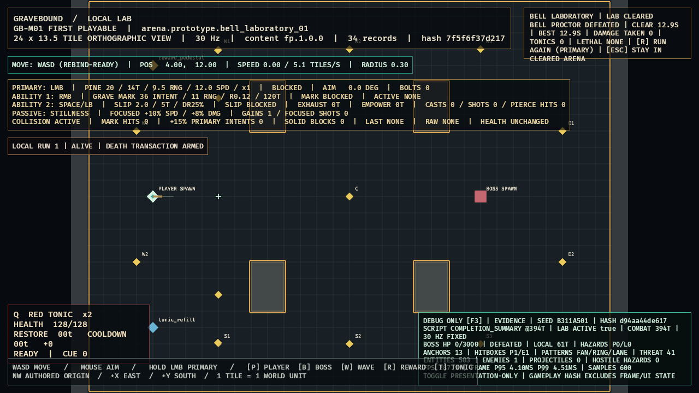

# GB-M01-04C completion audit

- **Status:** PASS (local gate; GitHub intentionally excluded)
- **Audited:** 2026-07-11
- **Authorities reviewed together:** all three authoritative design documents, including `CONT-FP-005/008/010` and roadmap implementation order 22

## Evidence

- Threshold cancellation, exact 90-tick breaks, `12000`-basis-point damage multiplier, Phase 2/3 timelines, ordered previews, rotating gap, cross geometry/contact, exclusion window, low-health restart, and downtime-only enrage have deterministic goldens.
- The composite boss simulation clears real hostile projectiles/lanes at thresholds and death. Friendly lethal damage prevents a later hostile step and emits defeat exactly once.
- A headless journey runs exact Wave `4 -> 6 -> 6 -> Bell Proctor` through real damage and persistent handoff. The performance suite adds a 60-second Bell replay and 20 identical complete 2,700-tick boss runs without crash, soft lock, or hash drift.
- The real completion route compiles the boss reward, reports clear/best/damage/Tonics/lethal status, supports reward resolution, primary Run Again, Escape, cleared-arena pause, and atomic fresh-run reconstruction. A release-evidence-discovered boss/normal reward modal overlap is fixed and regression-tested.
- Active evidence: [`GB-M01-04B-04C.png`](../evidence/GB-M01-04B-04C.png). Completion evidence: [`GB-M01-06B-boss-completion.png`](../evidence/GB-M01-06B-boss-completion.png), SHA-256 `FCF426F0DDE2962872BA19F44446046EA0FBD5A6DB838D9C879054FCA9D100C5`.

