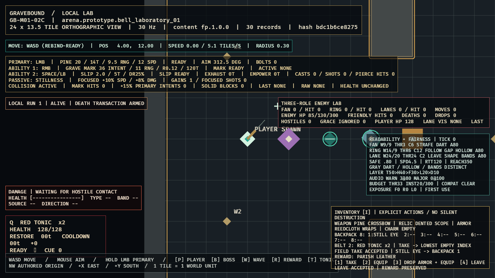

# GB-M01-07A completion audit

- **Status:** PASS
- **Date:** 2026-07-11

## Current evidence

| Criterion | Evidence | Result |
|---|---|---|
| Exact inventory shape | Four typed equipment slots, eight backpack stacks, shared two-slot belt. | PASS |
| Deterministic field placement | Take/Equip/swap/full/expiry/duplicate/Tonic fixtures are clone-before-commit and replay-identical. | PASS |
| Reward parity | Core reward Take/Equip/Drop Existing/Leave/capacity paths reuse field placement and pass tests. | PASS |
| Death ownership | Live lifecycle inventory is the same inventory cleared by 06A; no separate client inventory exists. | PASS |
| Field presentation | Keyboard-toggleable overlay shows exact slots and a canonical Still Eye accepted into backpack index 1. | PASS |
| Reward-panel presentation | `[1]` Take, `[2]` Equip, `[3]` Drop Armor + Equip, and `[4]` Leave map to exact core choices; evidence executes Leave and preserves the reward. | PASS |
| Field reach | Public field placement requires validated pickup/player positions and exact automatic `<=0.75` or Interact `<=1.25` reach; tangent, just-outside, and nonfinite cases pass transactionally. | PASS |

## Accepted partial evidence

- Cumulative local gate: 243 tests (`client_bevy` 31, `content_schema` 3, `sim_content` 23, `sim_core` 186), strict Clippy/content validation, and identical repeated traces.
- Optimized build: passed; accepted runtime logs contain zero output.
- Inspected field/reward frame: [`GB-M01-07A.png`](../evidence/GB-M01-07A.png), SHA-256 `3E701ECD679AE945D039611EE332482DDCCF16402150EAE8358EEC262588955B`.

An incomplete earlier optimized GPU composite was rejected. The accepted final binary places the Still Eye exactly `0.75` tiles from the player and shows its accepted automatic Take into backpack index 1, exact equipment/backpack/belt shape, Parish Leather reward, every keyboard action, lowest-index/no-silent-destruction policy, and `LEAVE ACCEPTED | REWARD PRESERVED` outside the central aiming corridor.
