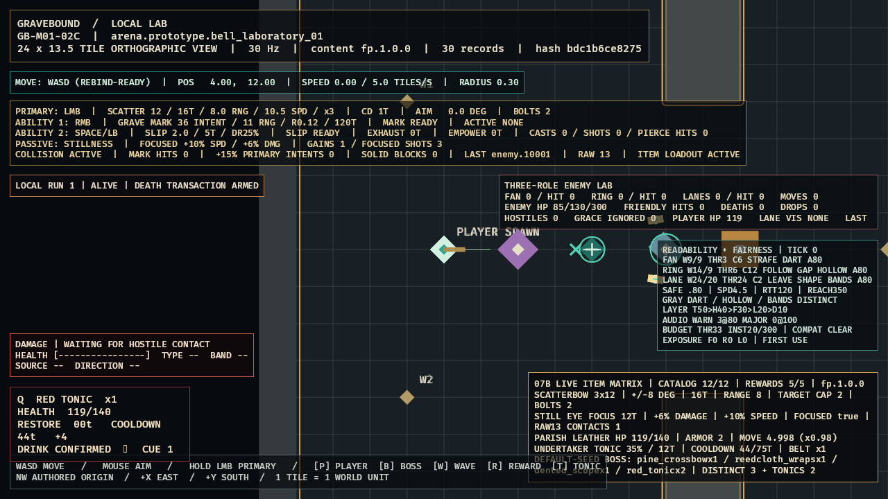

# GB-M01-07B completion audit

- **Status:** PASS
- **Date:** 2026-07-11
- **Decision:** [ADR-014](../decisions/ADR-014-prototype-items-and-reward-resolution.md)

## Acceptance evidence

| Criterion | Evidence | Result |
|---|---|---|
| Exact catalog | All 12 IDs compile to typed slot/rarity/behavior definitions; every numeric effect mutation fails. | PASS |
| Crossbow execution | Pine, Repeater, Longbolt, and Scatterbow compile; Scatterbow emits fixed `-8/0/+8` bolts and caps a target at two raw-12 intents. | PASS |
| Exact rewards | Five ordered tables compile; payload drift fails; normal independent checks produce none/equipment/Tonic/both. | PASS |
| Deterministic goldens | Default seed/resolution 7 is pinned for all tables; Wave 3 excludes its selected Charm and boss returns three distinct equipment plus Tonic x2. | PASS |
| Four visible behaviors | Inspected frame proves live Scatterbow raw-13 Focused contact, Still Eye, Parish Leather, and Undertaker Knot values. | PASS |
| Local quality gate | 249 tests, strict Clippy/content validation, identical traces, optimized build, zero-output runtime logs. | PASS |

## Accepted runtime evidence

- [`GB-M01-07B.png`](../evidence/GB-M01-07B.png), SHA-256 `B7ED55809215835DBE396E014ECA0CDB71D46435986E88FA8B3E9322D8D0FE5C`.

The frame reads live resolved state: Scatterbow `3x12`, three directions, 16-tick cadence, target cap 2, and raw-13 Focused contact; Still Eye focus at 12 ticks with `+6%/+10%`; Parish Leather health 140, armor 2, movement 4.998; Undertaker Knot 35% Tonic and 75-tick cooldown; and the exact default-seed boss reward golden. Incomplete GPU composites were rejected before accepting this complete frame.
