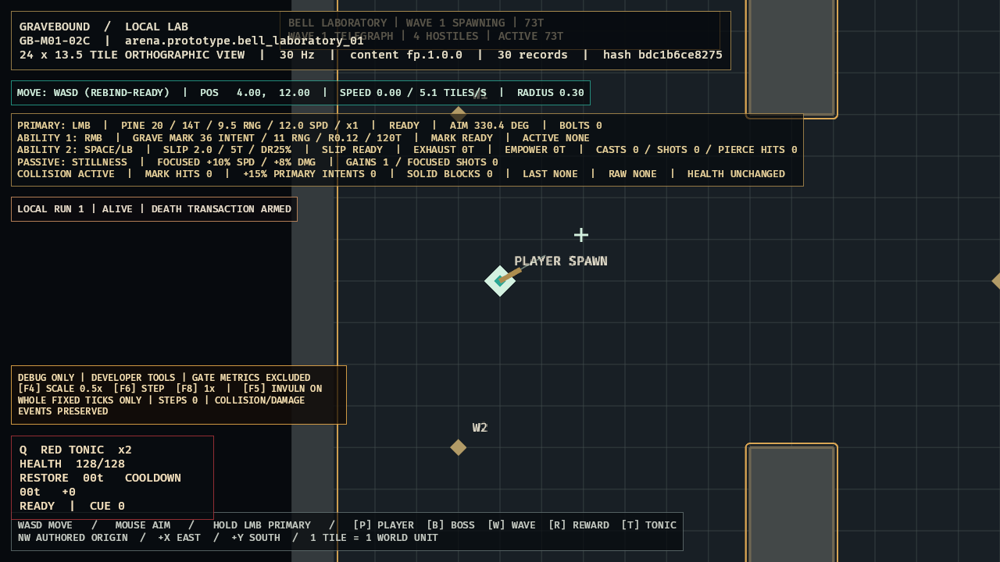

# GB-M01-08B completion audit

- **Status:** PASS (local gate; GitHub intentionally excluded)
- **Date:** 2026-07-11
- **Decision:** [ADR-016](../decisions/ADR-016-developer-time-and-invulnerability-tools.md)

## Acceptance evidence

| Criterion | Evidence | Result |
|---|---|---|
| Release-safe default | Developer state starts disabled, `1x`, vulnerable; standard hostile wrappers and every new run use `HostileDamagePolicy::Standard`. | PASS |
| Exact time controls | F4 exact cycle, F8 reset, paused-only F6, and gate-exclusion state have direct tests; scale changes virtual-time accumulation while fixed simulation retains whole 30 Hz steps. | PASS |
| Transactional invulnerability | Direct transaction preserves target, Tonic, combat, barrier/status state while retaining hypothetical canonical damage and a marked zero-application event. | PASS |
| Projectile/lane integration | Actual projectile contact remains terminal/consumed and both projectile and lane fixtures emit marked hypothetical damage with unchanged actual health. | PASS |
| Metrics isolation | Non-`1x`, invulnerability, or any single-step makes the session gate-ineligible; gameplay hash excludes developer presentation/runtime state. | PASS |
| Visual evidence | Screenshot-only fixture visibly labels `DEBUG ONLY`, active `0.5x`, invulnerability ON, fixed-tick behavior, controls, and `GATE METRICS EXCLUDED`. | PASS |
| Dependency | Normal Wave 1–3 portion of `08A` passes; Bell Proctor overlay portion awaits `SPEC-CONFLICT-001/002` owner direction. | PENDING |

## Verification

- `tools\dev.cmd ci`: PASS.
- Workspace tests: 268 (`client_bevy` 38, `content_schema` 3, `sim_content` 28, `sim_core` 199).
- Strict workspace all-target Clippy with warnings denied: PASS.
- Strict content validation and repeated M00 trace hashes: PASS and identical.
- Optimized Windows release build: PASS.
- Evidence: [`GB-M01-08B.png`](../evidence/GB-M01-08B.png), SHA-256 `7771BE99F0C6A246C29D3976327C1BFE4C63C5E8B391A8F4C34EFB8B4986336F`.

## Visual review

The compact lower-left panel remains outside the center combat lane and is unambiguous about developer-only state. It complements rather than replaces the authoritative encounter/debug surfaces.

## Remaining corrective work

None in `08B`. `GB-M01-08A` now passes for normal waves and the live Bell Proctor composite; developer-altered sessions remain intentionally excluded from gate telemetry.
