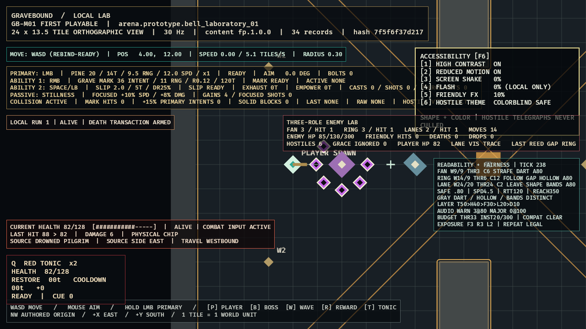

# GB-M01-10A completion audit

- **Status:** PASS (local gate; GitHub intentionally excluded)
- **Audited:** 2026-07-11
- **Authorities reviewed together:** GDD `UI-010/030`, `ART-005/006/030`; all FP hostile definitions; roadmap `GB-M01-10A`

## Evidence

- `AccessibilitySettings` enforces exact shake/flash/friendly-opacity boundaries and safe defaults.
- The `[F6]` keyboard panel exposes high contrast, reduced motion, shake, localized flash, friendly opacity, and hostile theme without entering fixed simulation.
- Reduced motion snaps only the presentation camera; authoritative movement and camera target remain unchanged.
- High-contrast/colorblind-safe treatment modifies hostile outline presentation while preserving tapered fan, hollow ring, and banded lane shapes. Hostile visibility is a hard invariant.
- Direct tests cover defaults, boundaries, complete preset cycles, and strict evidence resolution parsing. Final cumulative verification passes 294 workspace tests (client 44, schema 3, content 30, simulation 217), warnings-denied all-target Clippy, strict content validation, repeated deterministic traces, optimized build/smoke, and the target-performance gate.
- Optimized evidence uses real Drowned Pilgrim/Bell Reed/Chain Sentry damage and shows `HIGH CONTRAST ON`, `REDUCED MOTION ON`, `SHAKE 0%`, `FLASH 0%`, `FRIENDLY FX 10%`, `COLORBLIND SAFE`, plus the no-culling statement.
- Evidence: [`GB-M01-10A.png`](../evidence/GB-M01-10A.png), SHA-256 `8EAB8D90790383194E313A1459368EF59581B5BD9CB1CA944C270D4805C6639C`.

## Resolution and projectile-preset matrix

The retained 1280x720 evidence set covers standard combat, live boss warning, low-health/death, inventory, high-contrast colorblind-safe projectiles, and thick-outline projectiles. The inspected 1920x1080 counterparts are:

| Surface | Evidence | SHA-256 |
|---|---|---|
| Standard combat | `GB-M01-10A-1080p-combat.png` | `AB82E7BD93C5B62E374E6DC03C0858C3B20D799D0FA093590652F31E913B0783` |
| Boss warning | `GB-M01-10A-1080p-boss.png` | `3720B2C0DFBA0A3B49F1376B87320189E1C51D5E3B24DAB53E0D44FA1D114B61` |
| Low health/death | `GB-M01-10A-1080p-low-health.png` | `6198491128D737689B83CF8FA1FEC7B71965E310C9FBFDECB89A8F5C3648A91F` |
| Inventory | `GB-M01-10A-1080p-inventory.png` | `EC294867FC83AB207B36CD5E903FF87EE8C9564EDABA89343ACF8E107A113DF8` |
| High contrast/colorblind safe | `GB-M01-10A-1080p-high-contrast.png` | `7C5AA5FD87FF6F620C7AF57D139EA3837B9DFE8ECAE434FBAA3C57EF5B6ECDC3` |
| Thick outline | `GB-M01-10A-1080p-thick-outline.png` | `914306FD81CECA6F1A557F5E3AADF7B768369FCA4370ECA6BCBBEA3E912A909F` |

The 720p thick-outline counterpart is SHA-256 `4F9D68C1AAD4F4AABC3FDF4E9BE2384F427C0D1BACBD4C08ABCB05EFC6B0C7E0`. Thick outline expands the real hostile outer sprite by 35%; it is not a label-only preset. All images preserve structural fan/ring/lane cues and hostile visibility.
