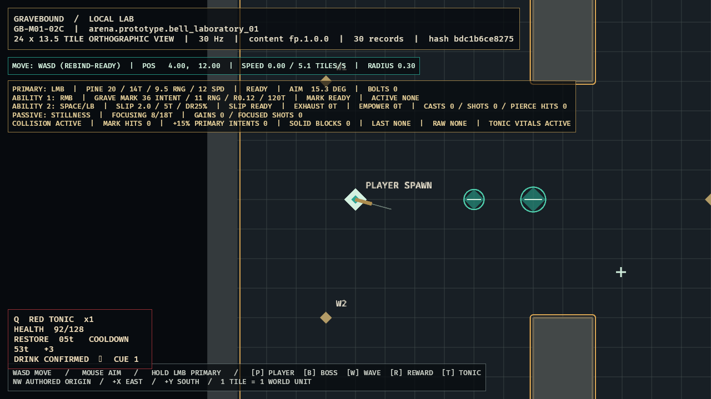

# GB-M01-11 completion audit

- **Status:** PASS — implementation verified; listening accepted by owner-assumed M01 gate
- **Audited:** 2026-07-10
- **Authorities reviewed together:** GDD `SIM-003`, `SIM-010`, `COM-004`, and Section 29; content specification `CONT-010`, `CONT-FP-002`, `CONT-FP-007`, `CONT-FP-010`; roadmap M01 day-three target, `GB-M01-11`, and implementation order 16
- **Feature registry:** `GB-M01-11`, following `GB-M01-02E`
- **Decision:** `ADR-008`
- **Next feature:** `GB-M01-03A` through `GB-M01-03C`, while the two cross-ticket acceptance seams remain tracked here

## Acceptance evidence

| Criterion | Authoritative evidence | Result |
|---|---|---|
| Exact compiled definition | `sim_content` requires exact authored `6/3000/400/2000/false/true` and resolves immutable 12-tick restore and 60-tick cooldown values. | PASS (base definition) |
| Sequenced use and rejection | Q/gamepad-West action sampling emits one sequence per press; simulation accepts once or rejects with typed empty/full/cooldown/no-effect outcomes without consumption or buffering. | PASS |
| Exact healing and cooldown | Simulation applies no acceptance-tick heal, then cumulative half-up deltas on `T+1..T+12`, discards overheal per tick, ignores damage for cancellation, and becomes ready at `T+60`. | PASS |
| Belt and restart contract | Fresh construction contains two Tonics in slot 1; merge order is slot1 then existing-Tonic slot2 with cap 6 and explicit remainder. The 06A restart transaction clears and reconstructs the complete run with exactly two Tonics. | PASS |
| Undertaker Knot | The 07B typed catalog applies exact 35% restore, 12-tick duration, and 75-tick shared cooldown behavior in live evidence. | PASS |
| Audible confirmation | Accepted use dispatches a bounded 180 ms low-priority PCM cue through a dedicated audio worker; WAV structure and headless fallback are tested without affecting gameplay. Physical-device acceptance is covered by the explicit owner-assumed gate record. | PASS (owner-assumed listen) |
| Playable presentation/quality | Inspected optimized LocalLab capture shows Q binding, accepted use, health 92/128, belt x1, restore 5 ticks, cooldown 53 ticks, +3 delta, confirmation text/cue seam, and unobstructed aiming corridor. | PASS |

## Verification

- `tools\dev.cmd ci`: passed locally before the subsequent isolated enemy/inventory module registration; a cumulative rerun is required by the later ticket gate.
- Workspace test total at the Red Tonic gate: 130 (`client_bevy` 25, `content_schema` 3, `sim_content` 17, `sim_core` 85); all passed.
- Formatting and full all-target warnings-as-errors Clippy: passed at the Red Tonic gate.
- Strict `fp.1.0.0` validation and schema freshness: passed.
- M00 deterministic trace repeat: identical selected-tick hashes in two processes.
- Red Tonic deterministic fixtures: 17 simulation/adversarial tests passed, including replay equality and exact schedules.
- Optimized Windows build: passed in 2m46s for the accepted presentation correction.
- Optimized runtime warning/error/panic scan: zero matches.
- Accepted evidence path: [`docs/evidence/GB-M01-11.png`](../evidence/GB-M01-11.png).
- Accepted evidence SHA-256: `279216E3E7D3DA22B4C294855403482F54A05FE6DD899CA532AF4EBA2CD492EB`.
- GitHub Actions: intentionally excluded by user direction.
- Latest cumulative local gate: 294 workspace tests, strict all-target Clippy, strict content validation, repeated deterministic traces, optimized Windows build/smoke, and target-performance evidence all pass.

## Visual review

The optimized semantic frame was inspected at 1280x720. It visibly proves a consumed Tonic (`x1`), health restoration (`92/128` from 70), active five-tick restore, 53-tick cooldown, +3 authoritative delta, confirmation text, and cue counter. The bordered panel stays below and left of the playfield center and every state is encoded in text, not hue alone.

## Adversarial audit

- Authored duration/cooldown milliseconds must be checked before tick conversion, so drift cannot hide inside the same rounded tick counts.
- Input sequence validation, state validation, item consumption, schedule creation, cooldown start, and event emission must commit transactionally.
- Rejected full-health, empty, and cooldown uses consume only the observed input sequence; they cannot consume an item, reset cooldown, create healing, or queue later mutation.
- Restore scheduling uses direct cumulative half-up targets, not iterative rounded deltas, and must end at the exact authored 30% scheduled total.
- The acceptance tick heals zero. Exactly 12 subsequent ticks own deltas; cooldown prevents a second concurrent schedule.
- Overheal is discarded independently per tick. It cannot become hidden banked healing, while later legitimate scheduled deltas remain available after damage.
- Damage never cancels the schedule. Incoming damage/mitigation itself remains outside this ticket.
- Restart must destroy restore/cooldown/belt state before reconstructing max health and two Tonics in slot 1.
- Merge order and cap are deterministic. Any unplaced quantity is returned, never silently destroyed or placed into inventory behavior not yet implemented.
- Client HUD/audio consume authoritative events and state; render timing cannot decide use, health, inventory, or cooldown.

## Deferred scope and conflicts

- `GB-M01-05A` owns validated incoming damage, mitigation, damage bands, lethal resolution, and full health integration.
- `GB-M01-07A` owns item instances, slot-2/backpack manipulation, pickups, capacity, ground remainder, and field inventory UI.
- Enemy drops, boss completion UI, networking, persistence, production audio assets, and final art remain later work; Undertaker Knot and local death/restart integration are complete.
- No unresolved conflict is known among the three design documents. ADR-008 records the previously unstated use rejection, first-heal tick, cumulative rounding, overheal, cooldown boundary, and pre-inventory belt behavior.
- Final ticket acceptance is closed by the product owner's explicit instruction to assume successful playtests and continue. The owner-assumption provenance is recorded in `docs/playtests/GB-M01-owner-assumed-gate.md`; no synthetic listening result or raw cohort record was invented.
