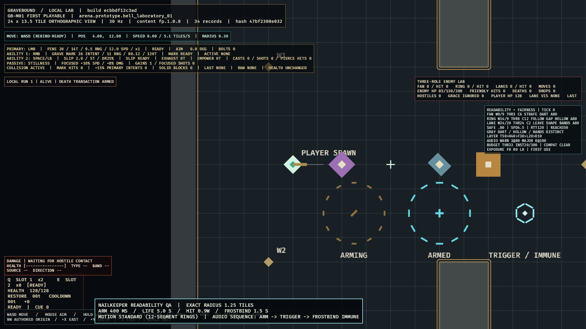
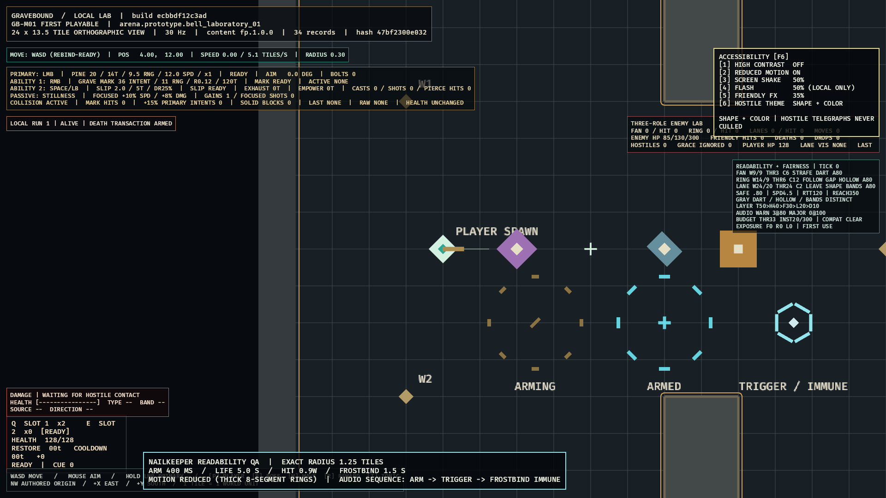

# GB-M03-05C completion audit

## Result

PASS. Both exact Grave Arbalist Oaths compile from immutable Core content into deterministic combat. Long Vigil resolves its Focused, Mark, range, damage, and maximum-health changes exactly. Nailkeeper resolves its cadence penalty, contact-created traps, arm/lifetime/cap/trigger rules, physical damage, normal-enemy Frostbind, boss application damage plus explicit immunity, accessible presentation, and durable combat-factory reconstruction. The normal player route and later paid Oath changes remain closed.

## Three-authority review

| Authority | Implemented evidence |
|---|---|
| Canonical GDD | `CLS-002`/`CLS-020` bind Long Vigil and Nailkeeper to the exact permanent-life mechanics. `COM-007` binds full normal-enemy Frostbind and major-boss movement immunity without suppressing application damage. Global stat caps preserve the 0.70 maximum-health floor. `ART-005`, `ART-010`, and accessibility language bind pale-cyan hexagonal Frostbind, shape-plus-label communication, distinct audio, and reduced-motion preservation. |
| Content Production Specification | The Core allowlist contains only the two exact Arbalist Oaths. Immutable checked-in records, production crossbows, deterministic microsecond cadence, rounding rules, and exact source revisions feed the runtime compiler without client-authored gameplay values. |
| Development Roadmap | `GB-M03-05` requires the first Arbalist shrine to present both exact choices. This slice closes their mechanics, persisted combat construction, restart proof, and native feedback while the parent audit remains the current next step. |

Approved `SPEC-CONFLICT-011` governs tag/source ownership and rate-before-Nailkeeper cadence composition.

## Acceptance evidence

| Requirement | Evidence | Result |
|---|---|---|
| Long Vigil exactness | Focused activates at 11 ticks; Grave Mark gains 2 tiles and a 20% marked-primary bonus; maximum health resolves at ×0.90. Focus breaks retain the canonical movement, Slipstep, and damage boundaries. | PASS |
| Nailkeeper exactness | Grave Mark enemy or wall contact creates one 1.25-tile trap. It arms after 12 ticks, lasts 150 ticks, snapshots 0.9W, Frostbinds for 45 ticks, caps at two, removes oldest deterministically, requires existing occupants to exit/re-enter, and selects the first legal target. | PASS |
| Combat authority | Trap triggers create trap-provenance physical intents in the shared damage transaction. Malformed trigger/intent pairs roll back. Normal enemies receive exact Frostbind; major bosses receive application damage and a typed movement-immunity result. | PASS |
| Content and stat composition | Both Oaths × every active/inactive subset of the three Core Bargains × all four production crossbows compile with one cadence rounding boundary and preserve global caps. Unknown, disabled, revision-drifted, or unresolved inputs fail closed. | PASS |
| Persisted construction | One atomic projection joins selected living identity, level, Oath, inventory version, and equipped weapon. The combat factory accepts only the exact Core-safe starter boundary, rebuilds the selected Oath before/after restart, and rejects incomplete or unsupported loadouts. | PASS |
| Standard presentation | The inspected release frame shows warm-brass arming, pale-cyan armed state, single/cross non-color notches, exact-radius 12-segment rings, a crystalline hexagonal Frostbind burst, and explicit trigger/immunity text without overlap. | PASS |
| Reduced motion | The inspected isolated preset retains the same scene, palette, opacity, exact radius, labels, notches, burst, and cues while using eight thicker stable segments and suppressing transient scaling. | PASS |
| Audio identity | The native evidence adapter sequences production arm, trigger, and immunity cues seven ticks apart and refuses capture if the audio worker closes. Deterministic bounded PCM fixtures prove distinct rising, falling, and pulsed cue identities with valid RIFF/WAVE encoding. | PASS |
| Dormant route | Core identity continues to return stage-disabled world transfer, admits no combat session, and exposes neither the normal player route nor paid Oath mutation. | PASS |

## Inspected evidence

### Standard motion

### Reduced motion

Both 1920×1080 frames were generated by the release client through the documented `nailkeeper_showcase` adapter and inspected at full-frame resolution. The first capture renders 12 thin ring segments; the second explicitly reports `REDUCED MOTION ON` and renders eight thicker segments. Arm, armed, trigger, immunity, exact numeric contract, and cue order remain visible in both.

## Verification

- [Authoritative run 29265860539](https://github.com/MikeyPar/Gravebound/actions/runs/29265860539) passes the PostgreSQL 17.10 migration/transaction job. Its mandatory gate explicitly passes `postgres_real_quic_server_restart_preserves_authoritative_roster`, covering selection, replay, restart, persisted factory construction, and exact post-restart combat equality.
- The same authoritative run passes workspace formatting, warnings-denied Clippy, all tests, content validation, deterministic trace repetition, schema drift, and Windows release construction.
- Current local closure passes workspace formatting, warnings-denied Clippy, all workspace tests (including 80 client tests), strict content validation, two byte-identical deterministic traces, generated-schema verification, Windows release construction, and `git diff --check`.
- The release evidence adapter runs the production presentation plan and production `rodio` worker, waits for all three cue dispatches plus settling frames, captures atomically, and exits.

## Deferred scope

Elite/miniboss half-duration and −10% Frostbind fixtures enter with those target classes. The 50-Ash purge transaction, later paid Oath changes, non-Arbalist Oaths, Core promotion, normal-route admission, and remaining M03 life systems stay under their owning packages. Parent `GB-M03-05` now requires its cross-slice completion audit.
